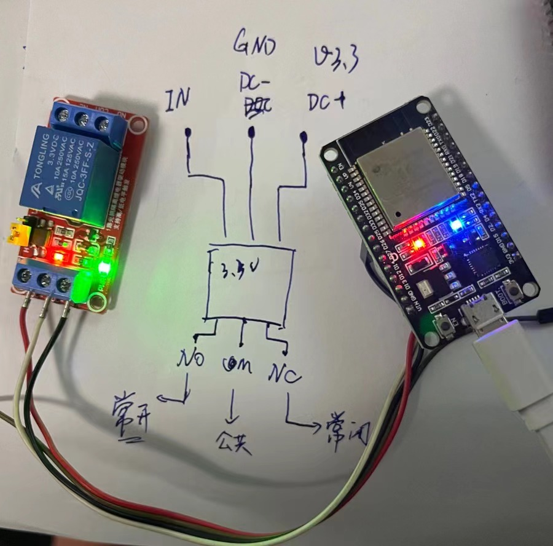
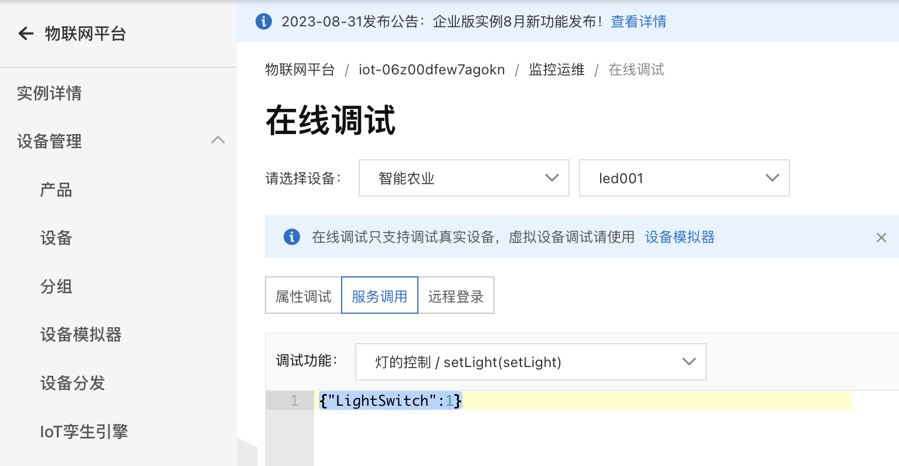

# 什么是 GPIO

GPIO 是通用输入输出端口（General Purpose Input Output）的缩写, 通用型之输入输出的简称，用于电信号在电路中的输入输出，以方便控制电路部件。


GPIO 即通用输入输出端口，就是芯片的一些引脚。作为输入端口时，我们可以通过它们读入引脚的状态--高电平或低电平，作为输出端口时，我们可以通过它们输出高电平或低电平来控制连接的外围设备。


## GPIO 控制 继电器

ESP32的原理图


### 继电器

继电器（Relay），也称电驿，是一种电子控制器件，它具有控制系统（又称输入回路）和被控制系统（又称输出回路），通常应用于自动控制电路中，它实际上是用较小的电流去控制较大电流的一种“自动开关”。故在电路中起着自动调节、安全保护、转换电路等作用。


### 引脚定义


### 实物图




::: tip
```c{183,28,23,212-217}
#include <Arduino.h>
#include <ArduinoJson.h>
#include <aliyun_mqtt.h>
#include <WiFi.h>

// https://techtutorialsx.com/2017/06/29/esp32-arduino-getting-started-with-wifi/
#define WIFI_SSID "PDCN"
#define WIFI_PASSWD "chajing.wang"

#define PRODUCT_KEY "k087jwI9Yiu"
#define DEVICE_NAME "led001"
#define DEVICE_SECRET "59e3bef09dadf061f7b5970b5c7a0c47"

#define ALINK_BODY_FORMAT "{\"id\":\"%u\",\"version\":\"1.0\",\"method\":\"%s\",\"Status:\":\"online\",\"params\":%s}"
#define ALINK_TOPIC_PROP_POST "/sys/" PRODUCT_KEY "/" DEVICE_NAME "/thing/event/property/post"
#define ALINK_TOPIC_PROP_SET "/sys/" PRODUCT_KEY "/" DEVICE_NAME "/thing/service/property/set"
#define ALINK_METHOD_PROP_POST "thing.event.property.post"


#define SET_TOPIC_LIGHT_ONE "/sys/" PRODUCT_KEY "/" DEVICE_NAME "/thing/service/ligth:setLight"

#define LED 2
#define D26 26

#define LED_OFF 0
#define LED_ON 1
int ledState = LED_OFF;
int gpioStatue = 0;
bool needReportStatus = true;
bool heartStatus = false;
int ledStateMapOutput[2] = {LOW, HIGH}; // ESP32Devkitc built-in LED output flip
// int ledStateMapOutput[2] = {LOW, HIGH}; // FireBeetle built-in LED output flip

unsigned long lastMqttConnectMs = 0;

unsigned int postMsgId = 0;

WiFiClient espClient;
PubSubClient mqttClient(espClient);

String translateEncryptionType(wifi_auth_mode_t encryptionType) {

  switch (encryptionType) {
    case (WIFI_AUTH_OPEN):
      return "Open";
    case (WIFI_AUTH_WEP):
      return "WEP";
    case (WIFI_AUTH_WPA_PSK):
      return "WPA_PSK";
    case (WIFI_AUTH_WPA2_PSK):
      return "WPA2_PSK";
    case (WIFI_AUTH_WPA_WPA2_PSK):
      return "WPA_WPA2_PSK";
    case (WIFI_AUTH_WPA2_ENTERPRISE):
      return "WPA2_ENTERPRISE";
    default:
      return "NULL";
  }
  return "NULL";
}

void scanNetworks() {

  int numberOfNetworks = WiFi.scanNetworks();

  Serial.print("Number of networks found: ");
  Serial.println(numberOfNetworks);

  for (int i = 0; i < numberOfNetworks; i++) {

    Serial.print("Network name: ");
    Serial.println(WiFi.SSID(i));

    Serial.print("Signal strength: ");
    Serial.println(WiFi.RSSI(i));

    Serial.print("MAC address: ");
    Serial.println(WiFi.BSSIDstr(i));

    Serial.print("Encryption type: ");
    String encryptionTypeDescription = translateEncryptionType(WiFi.encryptionType(i));
    Serial.println(encryptionTypeDescription);
    Serial.println("-----------------------");
    Serial.println("D26:");
    Serial.println(digitalRead(D26));
    gpioStatue = digitalRead(D26);
    Serial.println(gpioStatue);
    Serial.println("-----------------------");

  }
}

void connectToNetwork() {
  WiFi.begin(WIFI_SSID, WIFI_PASSWD);

  while (WiFi.status() != WL_CONNECTED) {
    delay(1000);
    Serial.println("Establishing connection to WiFi..");
  }

  Serial.println("Connected to network.");

}

void mqttCheckConnect()
{
  bool connected = connectAliyunMQTT(mqttClient, PRODUCT_KEY, DEVICE_NAME, DEVICE_SECRET);
  if (connected) {
    Serial.println("MQTT connect succeed!");
    if (mqttClient.subscribe(ALINK_TOPIC_PROP_SET)) {
      Serial.println("subscribe done.");
    } else {
      Serial.println("subscribe failed!");
    }
  }
}

void mqttPublish()
{
  char param[32];
  char jsonBuf[128];

  sprintf(param, "{\"LightSwitch\":%d}", ledState);
  Serial.print(ledState);
  postMsgId += 1;
  sprintf(jsonBuf, ALINK_BODY_FORMAT, postMsgId, ALINK_METHOD_PROP_POST, param);

  if (mqttClient.publish(ALINK_TOPIC_PROP_POST, jsonBuf)) {
     Serial.print("Post message to cloud: ");
     Serial.println(jsonBuf);
  } else {
    Serial.println("Publish message to cloud failed!");
  }
}

// https://pubsubclient.knolleary.net/api.html#callback
void callback(char* topic, byte* payload, unsigned int length){

  if (strstr(topic, SET_TOPIC_LIGHT_ONE)){
    Serial.print("Set message arrived [");
    Serial.print(topic);
    Serial.print("] \n");
    payload[length] = '\0';
    Serial.println((char *)payload);

    // Deserialization break change from 5.x to 6.x of ArduinoJson
    DynamicJsonDocument doc(256);
    DeserializationError error = deserializeJson(doc, payload);
    if (error)
    {
      Serial.println("parse json failed");
      return;
    }

    // {"method":"thing.service.property.set","id":"282860794","params":{"LightSwitch":1},"version":"1.0.0"}
    JsonObject setAlinkMsgObj = doc.as<JsonObject>();
    // LightSwitch
    int desiredLedState = setAlinkMsgObj["params"]["LightSwitch"];

    Serial.print("\n\n");
    Serial.print(desiredLedState);
    Serial.print("\n\n");
    Serial.print(setAlinkMsgObj);
    Serial.printf("%s\n", setAlinkMsgObj["id"]);
    Serial.print("\n\n");

    if (desiredLedState == LED_ON || desiredLedState == LED_OFF) {
      needReportStatus = true;
      ledState = desiredLedState;

      const char* cmdStr = desiredLedState == LED_ON ? "on" : "off";
      Serial.print("Cloud command: Turn ");
      Serial.print(cmdStr);
      Serial.println(" the light.");
    }
  }
}

void setup() {
    Serial.begin(115200);

    pinMode(LED, OUTPUT);
    pinMode(D26, OUTPUT);

    scanNetworks();
    connectToNetwork();

    Serial.println(WiFi.macAddress());
    Serial.println(WiFi.localIP());

    // WiFi.disconnect(true);
    // Serial.println(WiFi.localIP());
    mqttClient.setCallback(callback);

    lastMqttConnectMs = millis();
    mqttCheckConnect();
}

void loop() {
    if (millis() - lastMqttConnectMs >= 5000) {
      lastMqttConnectMs = millis();
      mqttCheckConnect();
    }

    // https://pubsubclient.knolleary.net/api.html#loop
    if (!mqttClient.loop()) {
      Serial.println("The MQTT client is disconnected!");
    }

    digitalWrite(LED, ledStateMapOutput[ledState]);

    if(ledState != gpioStatue) {
      gpioStatue = ledState;
      Serial.println("hello in if");
      Serial.println(ledState);
      digitalWrite(D26, ledStateMapOutput[ledState]);
    }
    

    if (needReportStatus) {
      mqttPublish();
      needReportStatus = false;
    }
}

```
:::


## 阿里云物联网平台




### Error

```md
unknown reference to "hwcrypto/aes.h" 

需要将 `hwcrytpto/aes.h` 换成 `esp32/aes.h` 文件.

```