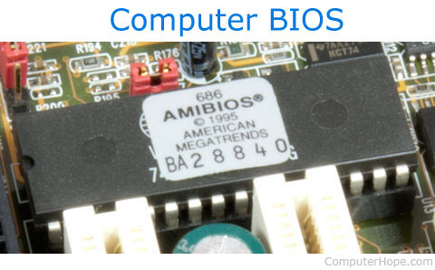
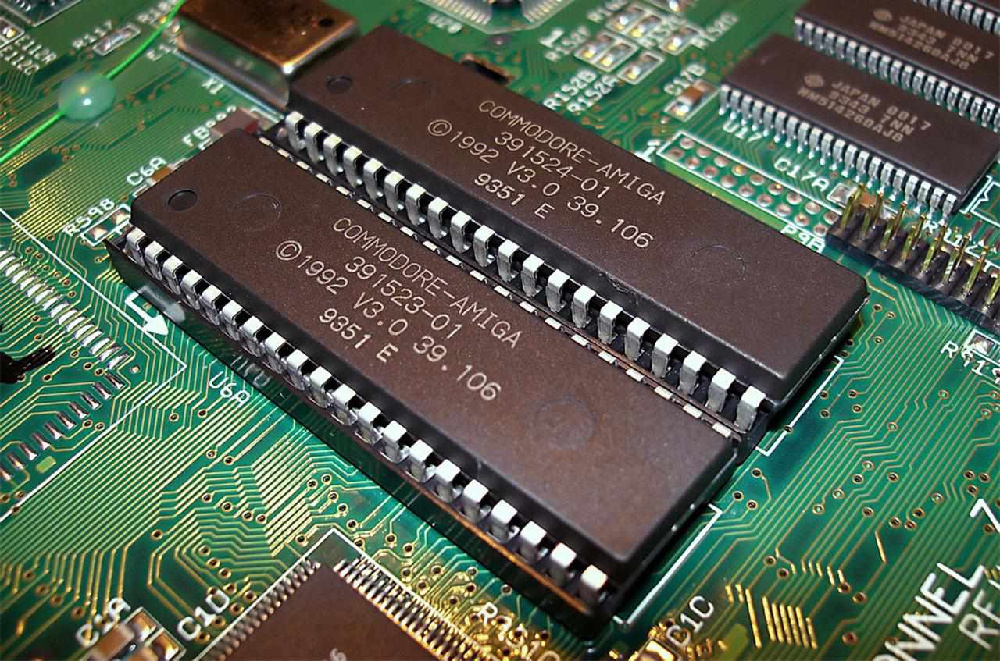
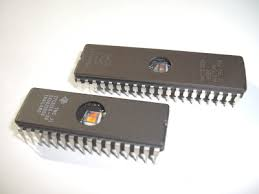
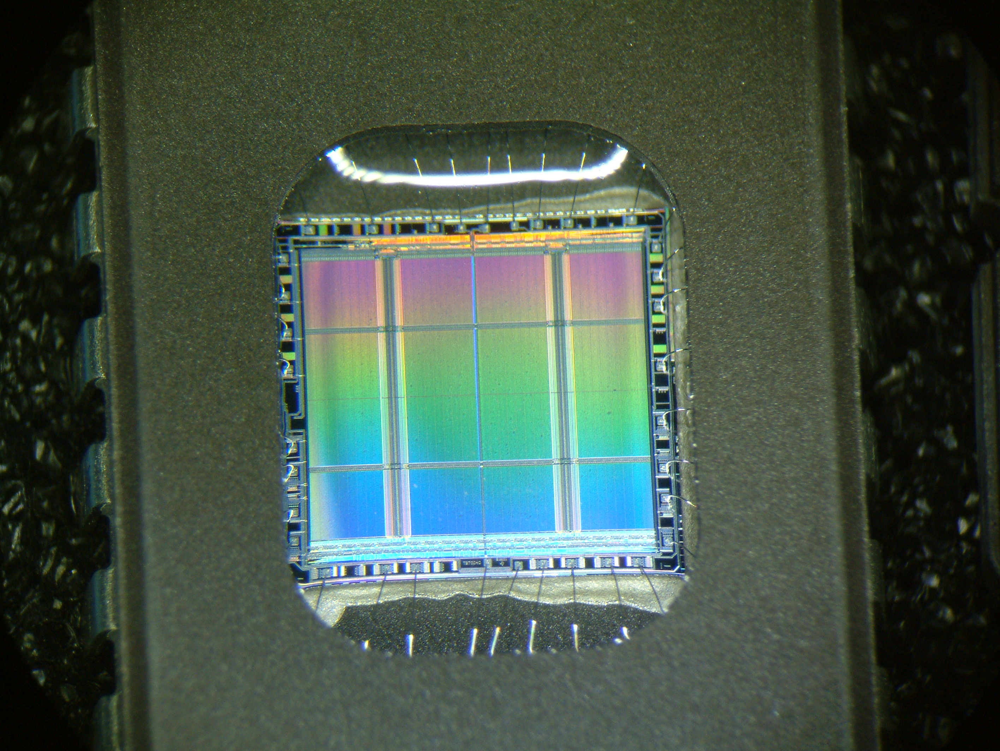
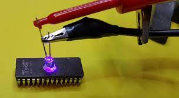
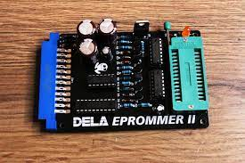
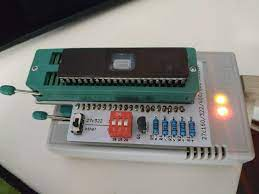

# E2PROM (EEPROM)

[[toc]]


**EEPROM生产出来的前提背景**



**BIOS芯片**



**ROM芯片**

在微机的发展初期，BIOS都存放在ROM（Read Only Memory，只读存储器）中。ROM内部的资料是在ROM的制造工序中，在工厂里用特殊的方法被烧录进去的，其中的内容只能读不能改，一旦烧录进去，用户只能验证写入的资料是否正确，不能再作任何修改。如果发现资料有任何错误，则只有舍弃不用，重新订做一份。ROM是在生产线上生产的，由于成本高，一般只用在大批量应用的场合。

由于ROM制造和升级的不便，后来人们发明了PROM（Programmable ROM，可编程ROM）。最初从工厂中制作完成的PROM内部并没有资料，用户可以用专用的编程器将自己的资料写入，但是这种机会只有一次，一旦写入后也无法修改，若是出了错误，已写入的芯片只能报废。PROM的特性和ROM相同，但是其成本比ROM高，而且写入资料的速度比ROM的量产速度要慢，一般只适用于少量需求的场合或是ROM量产前的验证。



**EPROM芯片**



**正面的陶瓷封装上,玻璃窗口**



**EPROM芯片 擦除数据**



**EPROM芯片 写入数据**



EPROM（Erasable Programmable ROM，可擦除可编程ROM）芯片可重复擦除和写入，解决了PROM芯片只能写入一次的弊端。EPROM芯片有一个很明显的特征，在其正面的陶瓷封装上，开有一个玻璃窗口，透过该窗口，可以看到其内部的集成电路，紫外线透过该孔照射内部芯片就可以擦除其内的数据，完成芯片擦除的操作要用到EPROM擦除器。EPROM内资料的写入要用专用的编程器，并且往芯片中写内容时必须要加一定的编程电压（VPP=12—24V，随不同的芯片型号而定）。EPROM的型号是以27开头的，如27C020(8*256K)是一片2M Bits容量的EPROM芯片。EPROM芯片在写入资料后，还要以不透光的贴纸或胶布把窗口封住，以免受到周围的紫外线照射而使资料受损。

**EEPROM - 基本原理**

由于EPROM操作的不便，后来出的主板上BIOS ROM芯片大部分都采用EEPROM（Electrically Erasable Programmable ROM，电可擦除可编程ROM）。EPROM【立创】的擦除不需要借助于其它设备，它是以电子信号来修改其内容的，而且是以Byte为最小修改单位，不必将资料全部洗掉才能写入，彻底摆脱了EPROM Eraser和编程器的束缚。EPROM在写入数据时，仍要利用一定的编程电压，此时，只需用厂商提供的专用刷新程序就可以轻而易举地改写内容，所以，它属于双电压芯片。借助于EPROM芯片的双电压特性，可以使BIOS具有良好的防毒功能，在升级时，把跳线开关打至“ON”的位置，即给芯片加上相应的编程电压，就可以方便地升级；平时使用时，则把跳线开关打至“OFF”的位置，防止CIH类的病毒对BIOS芯片的非法修改。所以，至今仍有不少主板采用EPROM作为BIOS芯片并作为自己主板的一大特色。

 

## EEPROM

EEPROM（Electrically Erasable Programmable read only memory）即电可擦可编程只读存储器，是一种掉电后数据不丢失（不挥发）存储芯片。


#### EEPROM具有以下几个突出的优势：

1. 非易失性：EEPROM内部数据的存储不依赖于电源，即使在断电或重新上电情况下，数据也能够长时间保留，确保了数据的可靠性和持久性。
2. 擦写次数多：EEPROM的擦写次数通常可达到数万次以上，远高于传统的ROM(只读存储器)。
3. 电子擦除：EEPROM是通过电子的擦除实现数据的清除操作，在实际应用中能够高效、精确地进行数据的擦除。
4. 随机读写：EEPROM具备随机读写的能力，可以按需读取和更新数据，无须整体擦除。
5. 低耗电：EEPROM在待机状态下的功耗非常低，适用于对功耗要求较高的场景。


## ESP32

ESP32内部没有专门的EEPROM，但是我们可以通过FLASH模拟EEPROM，FLASH与EEPROM也是非常相似的，都是非易失性存储器，使用EEPROM，我们就可以在不使用文件系统的情况下，来保存一些数据，可以实现一些更加复杂的功能。

例如，我们可以做到以下功能：

* 保存变量的最终状态
* 保存我们的设置
* 保存设备被激活的次数
* 永久保存其它任何类型的数据
* ESP32在Arduino是使用FLASH开辟的一块存储区域，默认的对象存储大小为4096个字节。


### EEPROM初始化

代码调用#include 后，已经默认定义了一个EEPROM对象，我们使用began方法初始化一下，参数为要操作的字节大小，最大为4096字节，所以这里的参数范围为0-4095。EEPROM的操作以字为单位，size最好设置为4的倍数。

```cpp
#include <EEPROM.h>
int size = 4096;
EEPROM.begin(size);
```


### 读取EEPROM

从EEPROM上读取一个字节，使用EEPROM.read()；参数为读取的地址。

```cpp
EEPROM.read(address);
```


### 写入EEPROM

将数据写入EEPROM，使用EEPROM.write()；第一个参数为地址，第二个参数为保存的值。

注意: 通过EEPROM.write()写入数据后，之后需要调用EEPROM.commit()使更改生效，写入完成。

```cpp
EEPROM.write(address, value);
EEPROM.commit();
```


### 写入/读取字符串

要在 ESP32 EEPROM 中写入字符串，请使用 EEPROM 库中的以下函数。

```cpp
// Write a String starting from a specific address location
EEPROM.writeString(address, &myString);
```

要从 ESP32 EEPROM 读取字符串，请使用下面所示的函数。

```cpp
// This will return the String stored @ the specified address
String myStr = EEPROM.readString(address);
```

### 写/读浮点

要在 ESP32 EEPROM 存储器（FLASH）中写入或读取 Float 变量，您无需逐字节检查它如何存储在存储器中。只需调用以下两个函数进行写和读操作即可。

```cpp
// Write a Floating Point Variable To EEPROM
EEPROM.writeFloat(address, myFloat);
 
// Read a Float Variable From EEPROM @ Specific Address
myFloat = EEPROM.readFloat(address);
```

### 读写所有数据类型

ESP32 EEPROM 库中还有两个有趣的 API（函数），您可以使用它们来写入和读取任何已知数据类型或用户定义的数据类型（例如结构体等）。它们是：put()和get()函数。

```cpp
// Write Any Data Type To ESP32 EEPROM
EEPROM.put(address, myData);
 
// Read Any Data Type From ESP32 EEPROM
EEPROM.get(address, myData);
```


### 读写 其他数据类型

以下是 ESP32 EEPROM 库中的一些 API，使您能够写入和读取所有已知数据类型。


下面对应的写入函数如下:

```cpp
// [EEPROM Write Functions]
size_t writeByte(int address, uint8_t value);
size_t writeChar(int address, int8_t value);
size_t writeUChar(int address, uint8_t value);
size_t writeShort(int address, int16_t value);
size_t writeUShort(int address, uint16_t value);
size_t writeInt(int address, int32_t value);
size_t writeUInt(int address, uint32_t value);
size_t writeLong(int address, int32_t value);
size_t writeULong(int address, uint32_t value);
size_t writeLong64(int address, int64_t value);
size_t writeULong64(int address, uint64_t value);
size_t writeFloat(int address, float_t value);
size_t writeDouble(int address, double_t value);
size_t writeBool(int address, bool value);
size_t writeString(int address, const char* value);
size_t writeString(int address, String value);
size_t writeBytes(int address, const void* value, size_t len);
```

下面对应的读取函数如下:

```cpp
// [EEPROM Read Functions]
uint8_t readByte(int address);
int8_t readChar(int address);
uint8_t readUChar(int address);
int16_t readShort(int address);
uint16_t readUShort(int address);
int32_t readInt(int address);
uint32_t readUInt(int address);
int32_t readLong(int address);
uint32_t readULong(int address);
int64_t readLong64(int address);
uint64_t readULong64(int address);
float_t readFloat(int address);
double_t readDouble(int address);
bool readBool(int address);
size_t readString(int address, char* value, size_t maxLen);
String readString(int address);
size_t readBytes(int address, void * value, size_t maxLen);
```


## 实验操作


### 实验一 记录灯的状态


通过保存最后的 LED 状态来测试 EEPROM 存储器。LED 通过按钮切换，每当其状态发生变化时，最后的状态都会保存到 EEPROM 中。我们将重置(断电重启) ESP32 板，它应该从 EEPROM 中读取最后保存的状态。


::: details 答案

```cpp
#include <Arduino.h>
#include <EEPROM.h>

#define KEY_1 25
#define LED_1 15

#define EEPROM_SIZE 1

int status = 0;
int flag = 1;

void setup() {
  Serial.begin(115200);
  pinMode(KEY_1, INPUT_PULLUP); //设置引脚为输入上拉模式
  pinMode(LED_1, OUTPUT); //设置引脚为输出模式
  EEPROM.begin(EEPROM_SIZE);
}

void loop() {
  Serial.println(digitalRead(KEY_1));
  delay(80);

  if(digitalRead(KEY_1) == 0) {
    if(flag) {
      flag = 0;
      status = !status;
      EEPROM.write(0, status);
      EEPROM.commit();
    }
  } else {
    flag = 1;
  }
  status = EEPROM.read(0); 
  digitalWrite(LED_1, status);
}
```

:::


### 实验二 记录结构体数据


