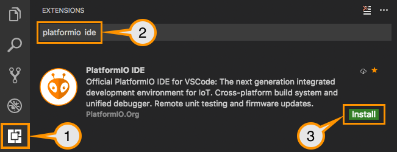

# arduino 简介

Arduino 是一个基于易于使用的硬件和软件的开源原型设计平台。Arduino 基于开放源代码的 Wiring 软件框架，并且具有丰富的扩展库。

通常我们说的Arduino语言，是指Arduino核心库文件提供的各种应用程序编程接口（Application    Programming        Interface，简称API）的集合。这些API是对更底层的单片机支持库进行二次封装所形成的。例如，使用AVR单片机的Arduino的核心库是对AVR-Libc（基于GCC的AVR支持库）的二次封装。

## 安装使用


# platformIO

PlatformIO 是一个跨平台的嵌入式开发环境，能直接支持 ESP-IDF。

由于 PlatformIO 对 ESP-IDF 的支持并非由 Espressif 团队维护， 如果遇到 PlatformIO 相关的问题，请通过 官方 PlatformIO 库 联系其开发人员。


## 安装使用

使用 vscode 插件, 安装 PlatformIO 并配置好 ESP-IDF 环境变量后，即可使用 PlatformIO 进行开发。


### 安装




### 启动页面


### 创建项目


点击上图中的第4中的 New Project 按钮，进入创建项目页面。


### 配置文件

```sh
# PlatformIO Project Configuration File
#
#   Build options: build flags, source filter
#   Upload options: custom upload port, speed and extra flags
#   Library options: dependencies, extra library storages
#   Advanced options: extra scripting
#
# Please visit documentation for the other options and examples
# https://docs.platformio.org/page/projectconf.html

[env:upesy_wroom]
platform = espressif32
board = upesy_wroom
framework = arduino
```


### 主程序

在 src 目录下, main.cpp 文件，并写入如下内容：

```c
#include <Arduino.h>

// put function declarations here:
int myFunction(int, int);

void setup() {
  // put your setup code here, to run once:
  int result = myFunction(2, 3);
}

void loop() {
  // put your main code here, to run repeatedly:
}

// put function definitions here:
int myFunction(int x, int y) {
  return x + y;
}
```

Arduino的代码结构：
1. Arduino程序中没有main函数，main函数隐藏在Arduino的核心库文件中，开发时一般不直接操作。
2. Arduino代码结构中有两个主要函数

setup()  初始化变量、引脚模式、调用库函数等

loop()   连续循环执行loop函数内的程序

### 编译


### Hello World

实现第一个程序 Hello World. 

<<< @/code/c/hello.c{c}

::: warning 思考题
上面的程序是 pc 下实现的. 如果我们需要在单片机上运行怎么去实现呢?
:::

### 串口通信

::: tip 提示
1. 需要设置串口波特率为115200, `Serial.begin` 函数来初始化串口.
2. 需要将 `printf` 替换为 `Serial.println`. 
:::

::: details 源代码

```c
#include <Arduino.h>

// put function declarations here:
int myFunction(int, int);

void setup() {
  // put your setup code here, to run once:
  int result = myFunction(2, 3);
  Serial.begin(115200);
  Serial.println("Hello world!");
  Serial.println(result);
}

void loop() {
  // put your main code here, to run repeatedly:
}

// put function definitions here:
int myFunction(int x, int y) {
  return x + y;
}
```

## 参考

[https://docs.wokwi.com/zh-CN/](https://docs.wokwi.com/zh-CN/)


