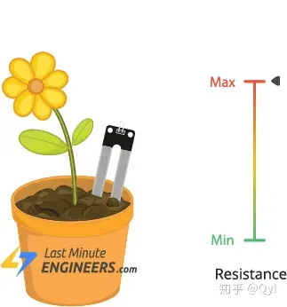
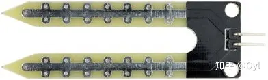
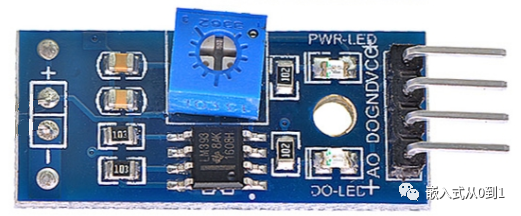
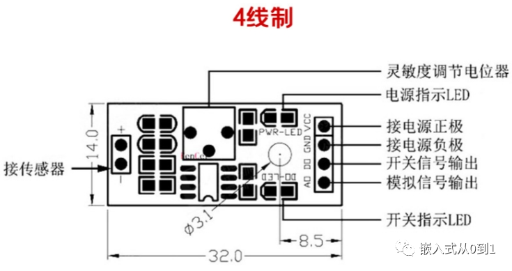
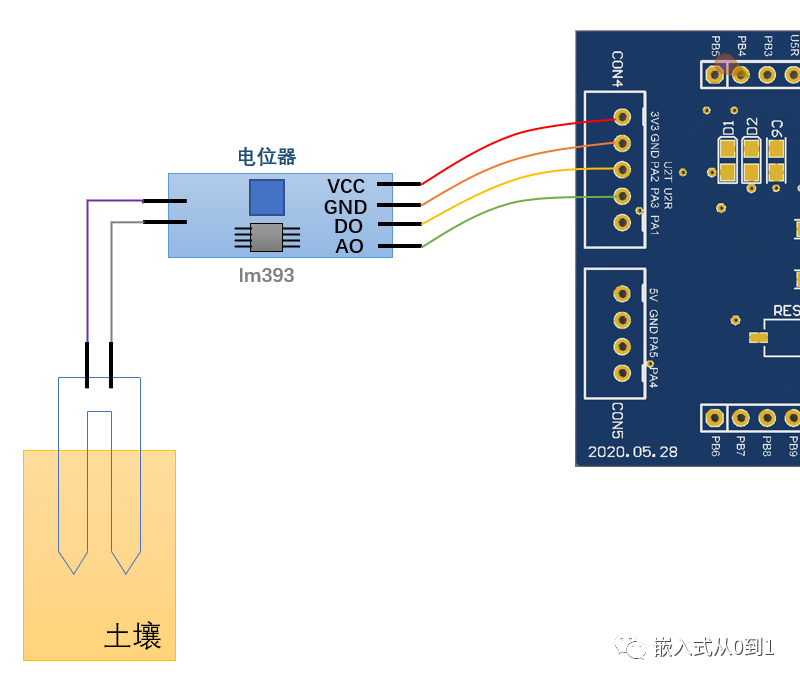
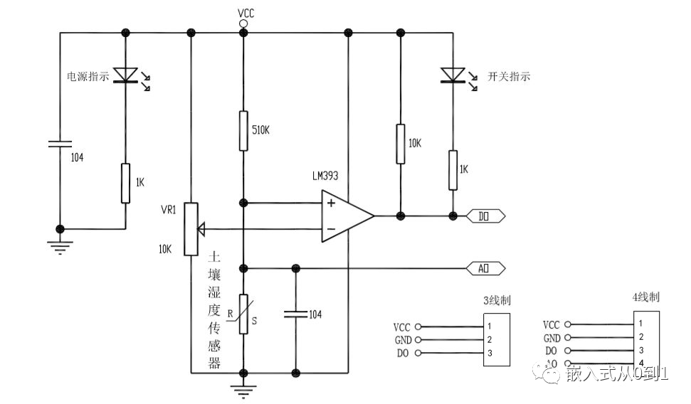
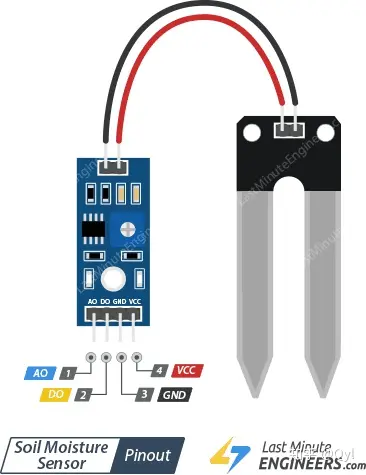
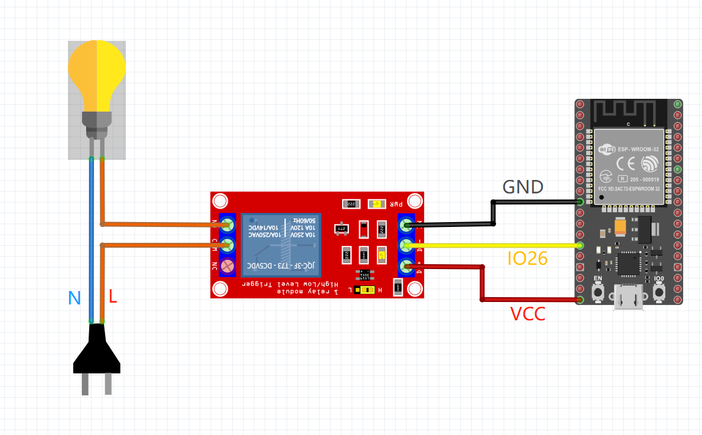

# 智能花盆 smart flowerpot

[[toc]]

## 智能花盆介绍

## 硬件设计

### 土壤温检测度模块

这块主要使用的 LM393 芯片，LM393 芯片是一种比较器，当输入电压高于参考电压时，输出为高电平，当输入电压低于参考电压时，输出为低电平。

#### 土壤湿度传感器的工作原理

带有两个裸露导体的叉形探针用作可变电阻器（就像电位计一样），其电阻根据土壤中的水分含量而变化。

该阻力与土壤湿度成反比：

土壤中更多的水意味着更好的电导率，并导致较低的电阻。
土壤中的水分越少，意味着电导率越差，并且电阻越高。
传感器根据电阻产生输出电压，通过测量我们可以确定水分含量。

#### 探针
* 该传感器包含一个叉形探针，该探针带有两个裸露的导体，可进入土壤或要测量水含量的其他任何地方。
* 如前所述，它充当可变电阻器，其电阻会根据土壤湿度而变化。

#### 模块

* 传感器还包含一个电子模块，用于将探针连接到Arduino。
* 该模块根据探头的电阻产生输出电压，并可以在模拟输出（AO）引脚上使用。
* 相同的信号被馈送到LM393高精度比较器以对其进行数字化，并在数字输出（DO）引脚处可用。

#### 原画图

**功能介绍**

* 传感器适用于土壤的湿度检测；
* 电压比较器采用LM393芯片；
* 模块中蓝色的电位器是用于土壤湿度的阈值调节。湿度低于设定值时，DO输出高电平，模块提示灯灭；湿度高于设定值时，DO输出低电平，模块提示灯亮；
* 顺时针调节，LM393的反向输入端输入电压越高，较低的湿度环境，模块即可输出低电平，模块灯亮；即向右旋转，增加模块的灵敏度。
* 逆时针调节，LM393的反向输入端输入电压越低，较高的湿度环境，模块才能输出低电平，模块灯亮。即为了让LM393电压比较器输出低电平，需要反向输入端电压大于正向输入端电压，而反向输入端电压已经通过电位器调低了（对应分压也变低了），那么只能将正向输入端的电压调的更低，只有湿度更大的情况下，正向输入端的电压才更低，所以将土壤湿度传感器向水中插入更深入才能触发模块的LED输出指示灯点亮。

LM393自带ADC功能，在空气中AO读取的值最大为4095 ， 浸泡在水里的最小值1250；放在潮湿的纸上，值大约为3090附近。

**模块引脚**

* AO（模拟输出）引脚为我们提供电源值至0V之间的模拟信号，取值范围在 0 ~ 4095 之间。值越大表示湿度最低, 否则湿度越高。
* DO（数字输出）引脚给出内部比较器电路的数字输出。当AO的值到达DO的阈值时，DO输出高电平。否则，DO输出低电平。
* VCC (正级) 引脚为传感器供电。使用3.3V – 5V之间的电压为传感器供电. **在这里我们使用的是 5V 供电**
* GND (负极) 接地引脚。

由电路原理图我们可以看出，模块的核心是一个电压比较器，采用了常见的LM393。

LM393的正相输入端接的是由两个电阻组成的分压电路，其中下电阻是土壤湿度传感器，该土壤湿度传感器就是两个电极，当两个电极之间有土壤连接之后，就等效为一个电阻，电阻值会随着土壤湿度变化而变化。实物图中，带两个大电极的那个就是土壤湿度传感器了。

LM393是电压比较器，将接在土壤湿度传感器端的两个电极插入土壤中，由于土壤中的水有一定的导电性，土壤湿度的变化会导致土壤的等效电阻值发生变化，将分压得到的电压信号传递给电压比较器的同相输入端，这个变化的电压信号与电压比较器的反相输入端的基准电压相比较。

在土壤干燥时，两个电极之间的等效电阻值很大，AO处分压点电压升高，一定程度后，使同相端电压大于反相端电压，电压比较器的输出端OUT输出高电平电压，此时开关指示灯不亮。

在土壤湿润时，两个电极之间的等效电阻值很小，AO处分压点电压下降，一定程度后，使同相端电压小于反相端电压，电压比较器的输出端OUT输出低电平电压，此时开关指示灯亮。

接在反相端端的电位器用于调节该端的电位电压，这个电压也就是电压比较器输入的阀值翻转电压，用于土壤湿度灵敏度调节。

### 浇水模块

GPIO 连接继电器. 控制继电器输出高电平，水汞打开, 实现浇水功能。

### 电源模块

## 软件设计

主要有系统控制和传感器采集两大模块组成。

### 核心控制模块

根据传感器采集的湿度值，判断是否浇水。 将定时, 去读取湿度传感器.

#### 传感器采集模块

**湿度模块工作原理**
* 通过电位器调节控制相应阀值，湿度低于设定值时，DO输出高电平，高于设定值时，DO输出低电平；
* 模块中蓝色的电位器是用于土壤湿度的阀值调节，顺时针调节，控制的湿度会越大，逆时针越小；
* 数字量输出D0可以与单片机I/O直接相连，通过单片机来检测高低电平，由此来控制LED灯的亮灭等定性地显示土壤湿度状态；
* 模拟量输出口AO读出所在湿度的状态值，然后转换为0~4095的数值，转换成百分比数值，通过这样的转换可以定量地获得土壤湿度更精确的数值；

#### 水汞控制模块

使用继电器控制水汞打开.

### 配置模块

这块能过 MQRT 协议, 实现将配置参数下发到开发板上, 再使用EEPROM将保存配参数.

### 数据通信模块

使用 EPS32 自带的 wifi 模块, 通过连接 wifi 模块, 使用 MQTT 协议实现数据上传. 主要将数据上传到 aliyun 的MQTT 服务器.

## 项目实现步聚

### 第一阶段

1. 实现硬件电路的连通
2. 实现传感器采集湿度值
3. 实现水汞控制
4. 根据湿度值判断是否浇水, 实现简单的控制作用

### 第二阶段

1. 实现 wifi 模块的连接, 并能与aliyun 服务器建立连接.
1. 实现配置模块, 实现配置参数的下发.
2. 实现数据通信模块, 将数据上传到阿里云.
3. 实现数据可视化.

