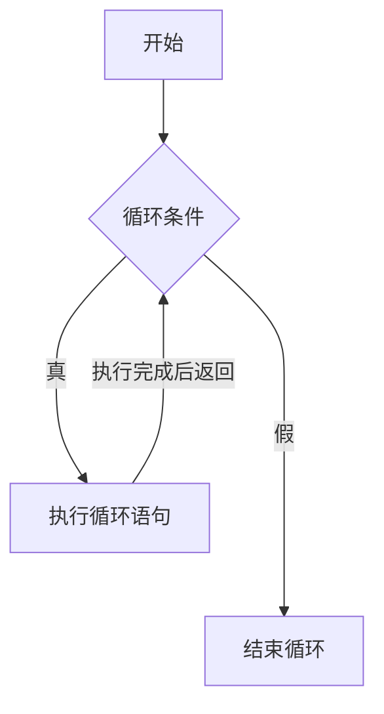

# 循环语句

循环结构是 C 语言中三大常用程序结构之一, 循环就是重复地执行同一段代码.
例如, 我们需要输出 10 行 “Hello world!” 在我们的屏幕上. 为了方便, 增加行号.


实现上面的代码:

``` c
#include <stdio.h>

int main() {
	printf("Hello world!\n");
	return 0;
}
```


## while

C 语言中的 while 语言使用方法:

```c
int main () {
		,------------------------------ C 语言 关键字 
		|  ,--------------------------- 循环的条件, 非零即为真. 
	while (1) {
		printf("Hello world!\n"); <---- 循环的语句
	}
};

```

上面输入的结果与我们想要的结果是不一样的. 那说明程序出现的另外的一种错误就是逻辑错误, 在工业界也称之为bug.
程序代码中最常见的两种错误, 一种是语法错误, 是编译时就能发现, 一种就是逻辑错误, 运行时才能发现, 但是有一些逻辑错误很难发现, 这个周期会长一些. 所以, 我们需要专业的软件测试工程, 对我们的代码进行测试. 帮助我们发现 bug 逻辑上的错误.

上面的代码, 我们需要引入计数器, 在这我们使用 int i 为计数变量, 用来存放我们输出多少行 hello world.
修改上面的代码, 如下:

```c
#include <stdio.h>

int main() {
	int i = 0;
	while (i < 10) {
		printf("Hello world!\n");
	}
	return 0;
}
```

发现运行结果还是不对, 想一下我们那里出的问题. 发现, 我们的计数变量并没有使用.
再次修改代码. 将输出完 hello world , 将 i 进行加 1.


全代码:

```c
#include <stdio.h>

int main() {
	int i = 0;
	while (i < 10) {
		printf("Hello world!\n");
		i++;
	}
	return 0;
}
```

这回代码对了.


#### 思考题

1. 输出行号. (printf 中的 %d)
2. 修改上面的程序的计数变量 i = i + 2; 看看循环结果是什么?
3. 修改上面的程序的循环条件 i < 20 看看输出的结果是什么?


#### 总结




### 字母转成数字

大家有没有注意到, 我们的手机在拔打的电话界面，按键式也好，拨号式也罢，除了1和0之外的2～9八个数位上，都各有三个或四个英文字母（手机上的按键字母顺序）。美国的电话号码不仅仅是十个数字的组合，还融进了英文字母, 便把电话号码以数字加字母的形式组合成代表某种意思的英文词汇——或公司名字，或产品品牌，既是电话号码，又是商业广告，一举两得。
例如,

1-800-STAPLES 是全球卓越的办公用品公司，创立于1986年的美国波士顿。(中文商标: 史泰博 订书钉)

1-800-GATEWAY 是一家1985年成立于美国爱荷华州的公司，现成长为美国知名的PC品牌.(中文商标: 捷威)。

1-800-helloword 是一家昆明著名的少儿编程培训学校.


::: details 程序代码:

```c
#include <stdio.h>
#include <ctype.h>

const char table[]="22233344455566677778889999";

int main(void){
	// 输入
	int ch;

	while((ch=getchar())!=EOF){
		if((ch>='a'&&ch<='z')||(ch>='A'&&ch<='Z'))
			ch = table[toupper(ch)-'A'];
		putchar(ch);
	}
	return 0;
}
	
```
::: 


这里用到几个知识点:

``` c
getchar(): 作用是从标准输入(键盘) stdin 中读取一个字符, 该函数以无符号 char 强制转换为 int 的形式返回读取的字符，如果到达文件末尾或发生读错误，则返回 EOF。

putchar(): 作用是向标准输出(屏幕) stdout 中写入一个字符, 该函数以无符号 char 强制转换为 int 的形式返回写入的字符，如果发生错误则返回 EOF。

toupper(): 作用是把小字母转成大字字符.

EOF: 是 End Of File 是C语言标准函数中表示文件结束符, 用来表示资料结束. C语言中的数据都是以字符串的ASCII代码值来存放的, ASCII的值是 0 ~ 127 , EOF定义为-1.
```


当程序调用getchar时，程序就等着用户按键。用户输入的字符被存放在键盘缓冲区中。直到用户按回车为止。当用户键入回车之后，getchar才开始从stdin流中每次读入一个字符。getchar函数的返回值是用户输入的字符的ASCII码，若文件结尾则返回-1(EOF)，且将用户输入的字符回显到屏幕。如用户在按回车之前输入了不止一个字符，其他字符会保留在键盘缓存区中，等待后续getchar调用读取。也就是说，后续的getchar调用不会等待用户按键，而直接读取缓冲区中的字符，直到缓冲区中的字符读完后，才等待用户按键。

## for

再例如, 我们要计算 1+2+3+4+ ... +99+100 的值, 就是重要重复执行加法运算.当然这个问题是一个很古老的问题, 想必大家都知道这可以使用高期的求和的公式轻松计算其结果.

数据公式:
```
(首项 + 末项) x 项数 / 2
```

1加到100的算式:
```
(1 + 100) x 100 / 2 = 5050
```

::: details 程序代码:

```c
#include <stdio.h>

int main () {
	int sum = 0;
	sum = 1+2+3+4+5+6+7+8+9+10+11+12+13+14+15+16+17+18+19+20+21+22+23+24+25+26+27+28+29+30+31+32+33+34+35+36+37+38+39+40+41+42+43+44+45+46+47+48+49+50+51+52+53+54+55+56+57+58+59+60+61+62+63+64+65+66+67+68+69+70+71+72+73+74+75+76+77+78+79+80+81+82+83+84+85+86+87+88+89+90+91+92+93+94+95+96+97+98+99+100;
	
	printf("1+2+3+4+5+6+7+8+9+10+11+12+13+14+15+16+17+18+19+20+21+22+23+24+25+26+27+28+29+30+31+32+33+34+35+36+37+38+39+40+41+42+43+44+45+46+47+48+49+50+51+52+53+54+55+56+57+58+59+60+61+62+63+64+65+66+67+68+69+70+71+72+73+74+75+76+77+78+79+80+81+82+83+84+85+86+87+88+89+90+91+92+93+94+95+96+97+98+99+100=%d", sum);
	return 0;
}
```

:::


C 语言中的 for 语言使用方法:

```c
int i;
 ,------------------------------------ C语言的关键字
 |     ,------------------------------ 设置计数器的初始值
 |     |       ,---------------------- 循环条件
 |     |       |     ,---------------- 计数器或循环的步长
for (i = 0; i < 10; i++) {
	printf("Hello world!\n"); <--------- 循环语句
}

```

那我们来实现一下. 输出 1+2+3+4+5+6+7+8+9+10+11+12+13+14+15+16+17+18+19+20+21+22+23+24+25+26+27+28+29+30+31+32+33+34+35+36+37+38+39+40+41+42+43+44+45+46+47+48+49+50+51+52+53+54+55+56+57+58+59+60+61+62+63+64+65+66+67+68+69+70+71+72+73+74+75+76+77+78+79+80+81+82+83+84+85+86+87+88+89+90+91+92+93+94+95+96+97+98+99+100 这文本内容.


::: details 程序代码:
```c
#include <stdio.h>


int main () {
	int i;
	for(i = 1; i <= 100; i++) {
		printf("%d", i);
		if(i != 100)
			printf("+");
	}
	return 0;
}

```
:::

### 思考题:

1. 如果将计数器的初始改为0, 还需要修改那些地方?
2. 用for循环实现 1 ~ 100 的加法运算.


