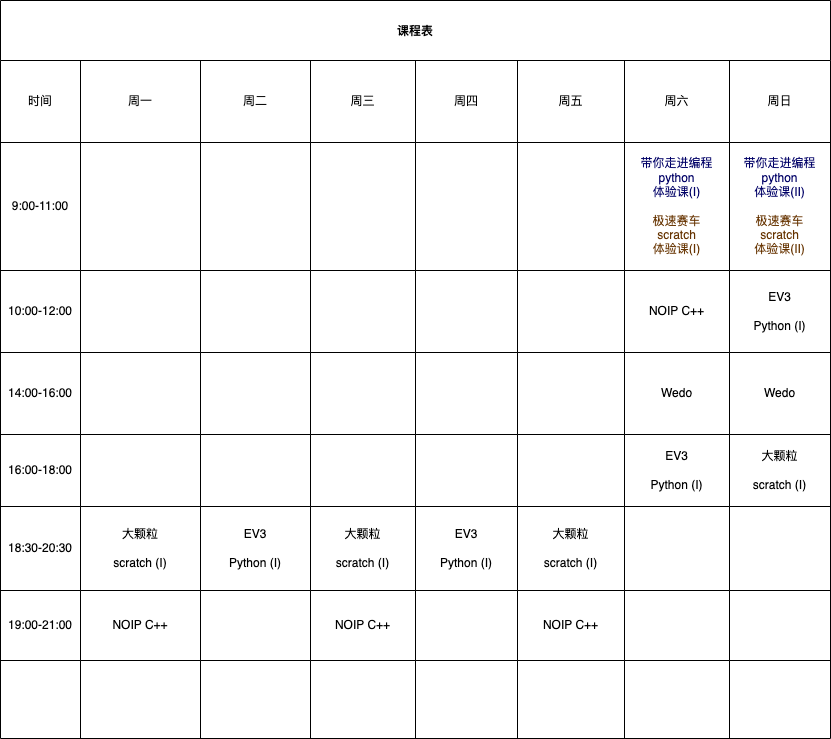

# 课表

 时间 | 周一 | 周二 | 周三 | 周四 | 周五 | 周六 | 周日
 ----|----|-------|-----|-----|-----|-----|-----
 上午09:00-11:00| | | | | | 带你走进编程世界 python体验课 (I) | 带你走进编程世界 python体验课 (II)
 上午10:00-12:00|
 下午 2:00-4:00|
 下午 2:00-4:00|

##### * 每课中间休息15分钟. 并有10分钟眼保健操

### Python寒假全托考级训练营

#### 课程亮点

- **系统学习Python编程语言基础知识**
  由经验丰富的Python专业人士亲自教授，系统掌握Python编程语言基础知识。

- **实践项目：编写小游戏和动画**
  学以致用，通过实际项目编写小游戏和动画，轻松上手，提高学生兴趣。

- **参加中国电子学会Python编程等级考试**
  为学生提供参加中国电子学会Python编程等级考试的机会，经由国家权威机构认证，获得具有金字招牌的证书。

- **小班授课，亲密互动**
  每班仅限招8名学生，确保个性化指导，提高学生学习效果。

- **60课时深度学习**
  为期三周的训练营，总计60课时，全方位提升学生Python编程技能。

#### 适用人群

小学4-6年级学生（10岁+）

#### 训练营时间

时间: 2024年1月15日-2月2日 周一至周五上课 节假日正常休息
*考试前3月16日下午进行考试复习*

编程课时长: 15天

#### 课程费用

3000元整 (赠送一次考级费280元)

**注：课程费用包含Python等级考试报名费。**

### 考级介绍

Python等级考试是由中国电子学会联合北京大学信息科学技术学院和腾讯公司等权威机构共同制定的全国级面向青少年软件编程能力水平的社会化评价。通过此考试，我们旨在评估学生的编程技能，并经由国家权威机构认证，为学生提供具有金字招牌的证书。

- **等级考试报名时间:** 2024年1月15日 ~ 2024年1月31日
- **等级考试时间:** 2024年3月23日 下午 14:00-15:00

### 训练营时间安排

| 时间          | 课程名称        | 任课教师     |
|---------------|-----------------|--------------|
| 09:00-09:50   | 寒假作业辅导    | 赵燕老师     |
| 10:00-10:50  | Python编程      | 王禹老师     |
| 10:50-11:00  | 早间保健操      | 王禹老师     |
| 11:10-12:00  | Python编程      | 王禹老师     |
| 12:00-12:40  | 午饭时间        | 吴颖老师     |
| 12:40-13:50  | 午休时间        | 吴颖老师     |
| 14:00-14:50  | 逻辑思维训练    | 李志飞老师   |
| 15:00-15:50  | 寒假作业辅导    | 赵燕老师     |
| 16:00-16:50  | Python编程      | 王禹老师     |
| 16:50-17:00  | 早间保健操      | 王禹老师     |
| 17:10-18:00  | Python编程      | 王禹老师     |

### Scratch寒假全托考级训练营

#### 课程亮点

- **创作互动故事**
  通过图形化编程工具Scratch，学生将创作属于自己的互动故事，发挥创意，培养逻辑思维。

- **小班授课，亲密互动**
  每班仅限招8名学生，确保个性化指导，提高学生学习效果。

- **60课时深度学习**
  为期三周的训练营，总计60课时，全方位提升学生Scratch编程技能。

#### 适用人群

小学2-6年级学生（8岁+）

#### 训练营时间

时间: 2024年1月15日-2月2日 周一至周五上课 节假日正常休息
*考试前3月16日下午进行考试复习*

编程课时长: 15天

#### 课程费用

2700元整 (赠送一次考级费280元)

**注：课程费用包含Scratch等级考试报名费。**

### 考级介绍

Scratch等级考试是由中国电子学会联合北京大学信息科学技术学院和腾讯公司等权威机构共同制定的全国级面向青少年软件编程能力水平的社会化评价。通过此考试，我们旨在评估学生的编程技能，并经由国家权威机构认证，为学生提供具有金字招牌的证书。

- **等级考试报名时间:** 2024年1月15日 ~ 2024年1月31日
- **等级考试时间:** 2024年3月24日 下午 14:00-15:00

### 训练营时间安排

| 时间          | 课程名称        | 任课教师     |
|---------------|-----------------|--------------|
| 09:00-09:50   | Scratch编程     | 马永吉老师   |
| 09:50-10:00   | 早间眼保健操      | 马永吉老师   |
| 10:50-11:00   | Scratch编程     | 马永吉老师   |
| 11:10-12:00   | 寒假作业辅导    | 赵燕老师     |
| 12:00-12:40   | 午饭时间        | 吴颖老师     |
| 12:40-13:50   | 午休时间        | 吴颖老师     |
| 14:00-14:50   | Scratch编程     | 马永吉老师   |
| 14:50-15:00   | 下午眼保健操      | 马永吉老师   |
| 15:10-16:00   | Scratch编程     | 马永吉老师   |
| 16:10-17:00   | 逻辑思维训练    | 李志飞老师   |
| 17:10-18:00   | 寒假作业辅导    | 赵燕老师     |

### 机器人编程寒假全托训练营

#### 课程亮点

- **实际机器人编程体验**
  通过使用乐高机器人套件，学生将亲身体验创造和控制机器人的乐趣，锻炼问题解决和团队协作能力。

- **小班授课，亲密互动**
  每班仅限招10名学生，确保个性化指导，提高学生学习效果。

- **60课时深度学习**
  为期三周的训练营，总计60课时，全方位提升学生机器人编程技能。

#### 适用人群

小学1-6年级学生（6岁+）

#### 训练营时间

时间: 2024年1月15日-2月2日 周一至周五上课 节假日正常休息
*考试前3月16日下午进行考试复习*

编程课时长: 15天

#### 课程费用

2490元整

### 训练营时间安排

| 时间          | 课程名称        | 任课教师     |
|---------------|-----------------|--------------|
| 09:00-09:50   | 机器人编程      | 郑达花老师   |
| 09:50-10:00   | 早间保健操      | 郑达花老师   |
| 10:50-11:00   | 机器人编程      | 郑达花老师   |
| 11:10-12:00   | 寒假作业辅导    | 赵燕老师     |
| 12:00-12:40   | 午饭时间        | 吴颖老师     |
| 12:40-13:50   | 午休时间        | 吴颖老师     |
| 14:00-14:50   | 机器人编程      | 郑达花老师   |
| 14:50-15:00   | 下午保健操      | 郑达花老师   |
| 15:10-16:00   | 机器人编程      | 郑达花老师   |
| 16:10-17:00   | 逻辑思维训练    | 李志飞老师   |
| 17:10-18:00   | 寒假作业辅导    | 赵燕老师     |

