# 平衡二叉树 (AVL)

[[toc]]

## AVL树

AVL树，又称为平衡二叉树，它是一种特殊的二叉查找树（Binary Search Tree, BST），其每一个节点的左右子树的高度差不超过1。

平衡二叉树递归定义如下：

1. **左右子树的高度差小于等于 1。**
2. **其每一个子树均为平衡二叉树。**

### 介绍

在二叉搜索树的那一节里，我们在最后提到了如果二叉树严重不平衡，其时间复杂度会退化到线性的复杂度，例如从有序数组[1, 2, 3, 4, 5]中构建出的二叉树，就会成为一个线性表，如下图所示。

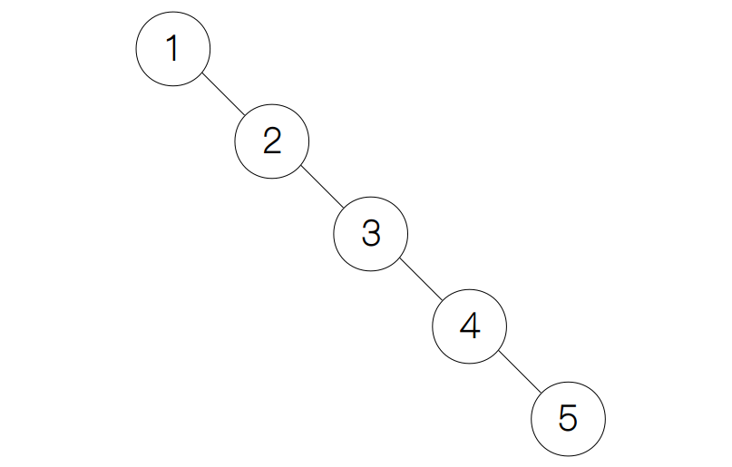

因此，我们需要有一棵能够自动平衡的二叉树，使得每次插入、删除和查找的复杂度都接近 Θ(nlog n) 的复杂度。AVL 树就是最早被提出的自平衡二叉搜索树，它是由两名俄国的科学家（G. M. Adelson-Velsky 和 E. M. Landis）提出。下面，我们就来看看它是如何做到自平衡的吧。

## 平衡因子

AVL 树最核心的思想就是计算每个节点的平衡因子（balance factor），平衡因子的定义是一个节点的左孩子的高度减去其右孩子的高度。这里的高度（height）就是指从一个节点出发到达最远叶子节点所经过的最长路径，例如下图的例子中节点 3 到达最远的叶子节点 2 所需要经过的路径长度为 2（从节点 3 到节点 1 和 从节点 1 到节点 2）。

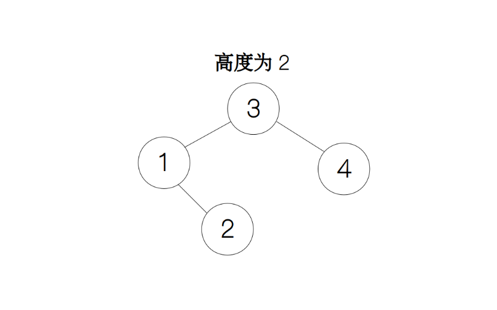

AVL 树最核心的思想就是计算每个节点的平衡因子（balance factor），平衡因子的定义是一个节点的左孩子的高度减去其右孩子的高度。这里的高度（height）就是指从一个节点出发到达最远叶子节点所经过的最长路径，例如下图的例子中节点 3 到达最远的叶子节点 2 所需要经过的路径长度为 2（从节点 3 到节点 1 和 从节点 1 到节点 2）。

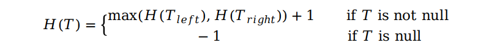

例如，下图中的两个例子，根节点的平衡因子分别为 2 和 -2。

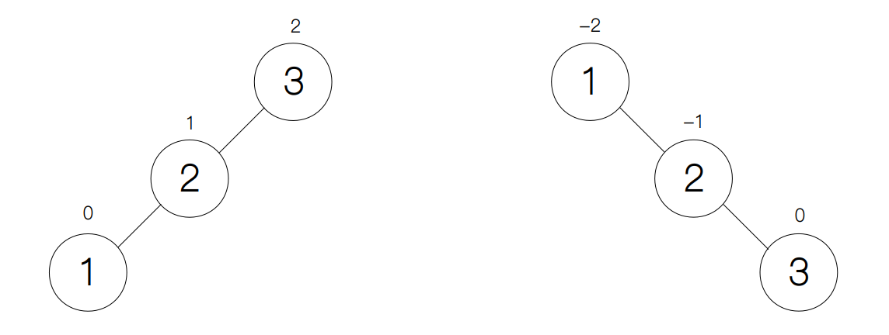

## 旋转操作

从前面的例子中，我们发现当一个节点的平衡因子的绝对值大于等于 2 时，树就不再平衡。这里，AVL 树提供了一种旋转机制，使得旋转过后的树不仅能保持二叉搜索树的性质，同时能够使节点的平衡因子的绝对值小于 2，接下来我们就分别来讨论一下不同情况下的旋转操作。

### LL 型

下图表示的是 LL 型的情况，在根节点的左孩子的左侧添加新节点 1 后，平衡因子从原来的 1 变为了 2，这时我们只需要对根节点 3 执行一次右旋操作树就平衡了。

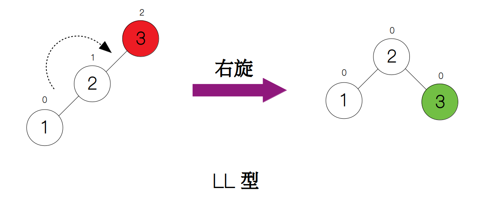

### LR 型

如果往根节点的左孩子的右侧添加新节点（下图中的节点 2），平衡因子也会从 1 变为 2，但这里我们不能采用单次右旋，而是要先对根节点的左孩子执行一次左旋操作，使之变为 LL 型，然后再对根节点进行右旋。

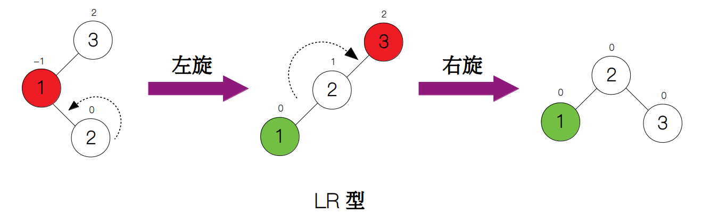

### RR 型

RR 型正好与 LL 型的互为镜像，如果向根节点的右孩子的右侧添加一个新节点（下图中的节点 3）后，平衡因子由 -1 变为 -2，导致树的不平衡，这时我们需要对根节点执行一次左旋操作。

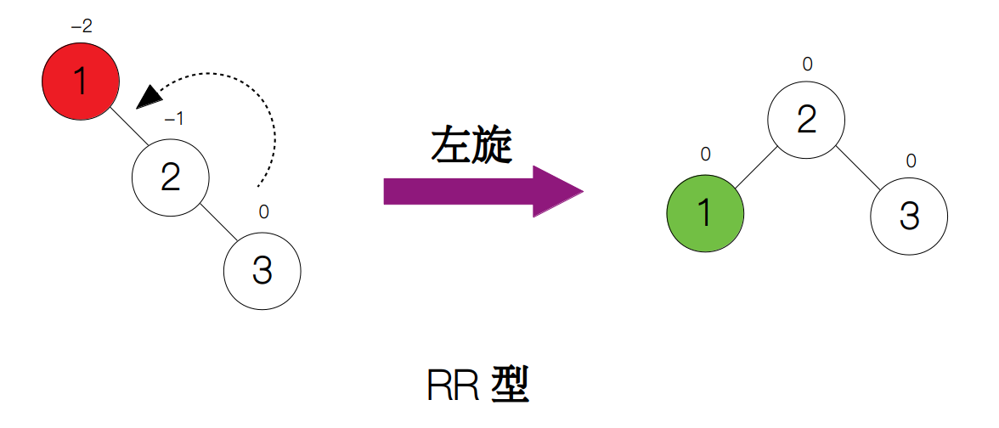

### RL 型

RL 型与 LR 型也互为镜像，即如果将新节点（下图中的节点 2）插入到根节点的右孩子的左侧，平衡因子由 -1 变为 -2。同样，我们不能用一次左旋来使树重新平衡，而是先对根节点的右孩子执行一次右旋，变为 RR 型，然后再对根节点进行左旋。

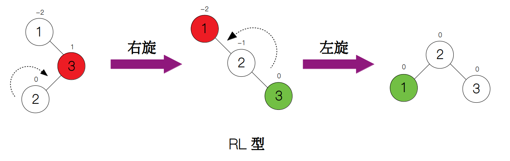

### 一般情况

我们看到，上述的四种情况都是基于两种基本操作：左旋和右旋。然而，我们讨论的并不是一般的情况。举个例子，如果要对下图中的根节点进行右旋，我们会发现根节点的左孩子的右子树不为空，这时该怎么办呢？我们知道，旋转之后的树必须保持二叉树的性质，所以我们可以让多余的右子树作为原根节点的左子树，使得原根节点的值还是大于被调整子树的所有节点的值。

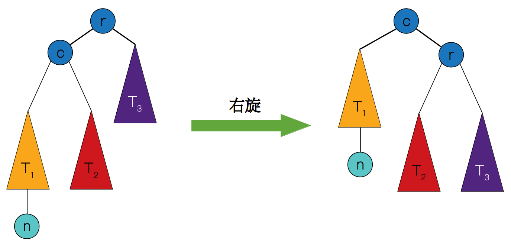

右旋的动态图可以见下图：
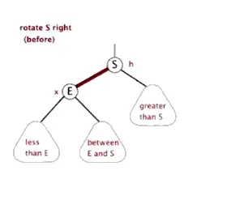

同理，下图也展示了左旋的一般情况，只是与右旋互为镜像操作。

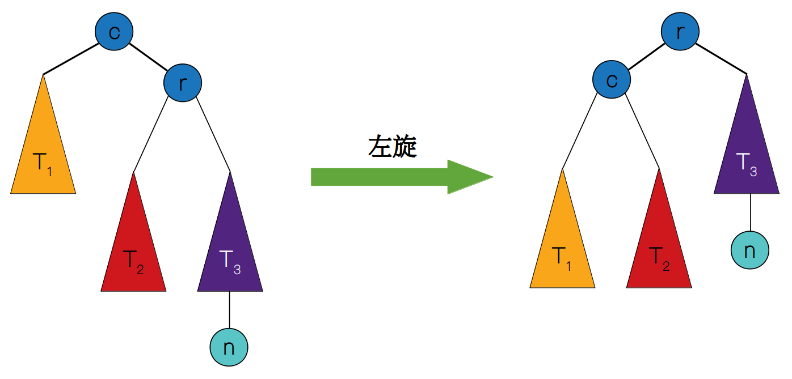

左旋的动态图可以见下图：
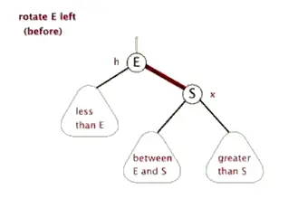

## 搜索 

和二叉搜索树一样，AVL 树也是从根节点开始搜索，如果搜索的元素比根节点小，那么就从根节点的左子树中继续搜索，如果比根节点大，那么就从右子树中继续搜索，如果相等，则返回该节点，要是搜索到了叶子节点发现还是搜索失败，我们就返回None。

## 插入

AVL 树的插入操作也跟二叉搜索树一样，先找到插入的位置，即通过搜索操作找到插入位点，然后创建一个新节点，最后父节点指向该新节点。但由于 AVL 树是一棵自平衡的树，所以每插入一个节点都会更新搜索过程中所经过节点的高度，如发现有节点的高度的绝对值大于等于 2，则采取相应的旋转操作使之保持平衡。这里调用了前面写好的settle_violation函数，整个过程均采用递归的方式实现。

## 删除

同样，AVL 树的删除操作也类似于二叉搜索树，找到删除的节点，然后根据待删除节点的孩子节点个数，判断出该采取哪一种删除方式，由于它跟二叉搜索树一样，这里就不再赘述了，忘记了的小伙伴可以乘坐这里的传送门，找到删除操作的那一部分再看一看。与插入操作一样，删除操作也会检查搜索过程中所经过的所有节点的高度，如果其绝对值大于等于 2，我们也调用settle_violation函数来使树保持平衡，整个删除操作也是一个递归的过程。

插入和删除操作都是由查找和旋转操作构成，故两者的复杂度均为 Θ(log n) + Θ(1) = Θ(log n)。

