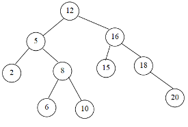
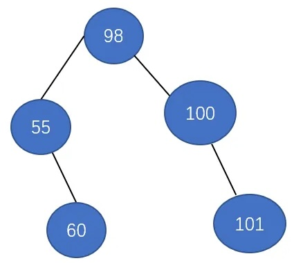
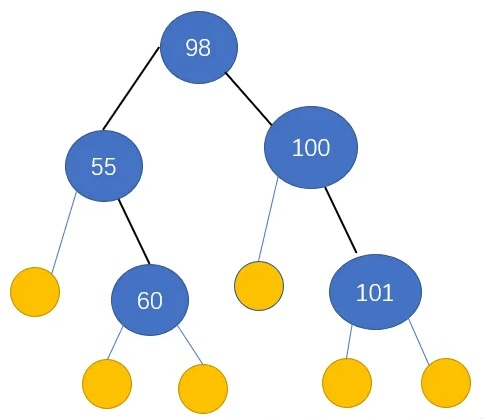

# 二叉排序树

[[toc]]


二叉排序树又叫二叉查找树（Binary Search Tree，BST）是一种特殊的二叉树，具有以下性质：

1. **结构特性：** 对于树中的每个节点：
   - 左子树中的所有节点的值小于该节点的值。
   - 右子树中的所有节点的值大于该节点的值。
   - 左右子树也分别是二叉查找树。

2. **唯一性：** 二叉查找树中不存在相同值的节点。

这些性质使得在二叉查找树中进行查找、插入和删除等操作的平均时间复杂度为 O(log n)，其中 n 是树中节点的数量。然而，最坏情况下，当二叉查找树严格退化为链表时，时间复杂度为 O(n)。

### 操作

1. **查找：** 从根节点开始，根据比较大小的规则，递归地在左子树或右子树中查找目标值。

2. **插入：** 从根节点开始，递归地在左子树或右子树中找到合适的位置插入新节点。

3. **删除：** 删除节点分为三种情况：
   - 若节点为叶子节点，直接删除。
   - 若节点有一个子节点，将其父节点指向子节点。
   - 若节点有两个子节点，找到右子树中的最小节点（或左子树的最大节点），用该节点替代要删除的节点。

### 例子

考虑以下二叉查找树：

```
        5
       / \
      3   7
     / \ / \
    2  4 6  8
```

在这个例子中，每个节点都满足二叉查找树的性质，左子树的值小于根节点的值，右子树的值大于根节点的值。

## 练习

**在一棵空的二叉排序树中依次插入关键字序列12, 5, 2, 8, 6, 10, 16, 15, 18, 20。**

::: details 答案

:::


## 二叉排序树的平均查找长度




查找成功时的平均查找长度：
ASL=∑（本层高度*本层元素结点个数）/结点总数

**$ASL_{{成功}} = {\frac{1*1 + 2*2 + 2*3}{5}}$**




查找失败时的平均查找长度:
ASL=∑(本层高度*本层补上的叶子结点数)/补上的叶子节点总数

**$ASL_{{不成功}} = {\frac{2*2 + 4*3}{6}}$**
