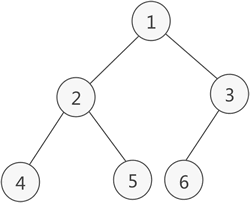

# 二叉树

[[toc]]


二叉树（binary tree）是指树中节点的度不大于2的有序树，它是一种最简单且最重要的树。 二叉树的递归定义为：二叉树是一棵空树，或者是一棵由一个根节点和两棵互不相交的，分别称作根的左子树和右子树组成的非空树；左子树和右子树又同样都是二叉树 。


###  二叉树的性质
性质一：在二叉树的第i层上至多有2^(i-1)个结点（i>0）

性质二：深度为k的二叉树至多有2^k-1个结点（k>0）

性质三：对任何一棵二叉树T，如果其终端结点数为n0，度为2的结点数为n2，则n0=n2+1


性质四：具有n个结点的完全二叉树的深度为floor(log2n)+1


### 满二叉树
除最后一层无任何子节点外，每一层上的所有结点都有两个子结点的二叉树。

国内教程定义：一个二叉树，如果每一个层的结点数都达到最大值，则这个二叉树就是满二叉树。也就是说，如果一个二叉树的层数为K，且结点总数是(2^k) -1 ，则它就是满二叉树。


### 完全二叉树
一棵深度为k的有n个结点的二叉树，对树中的结点按从上至下、从左到右的顺序进行编号，如果编号为i（1≤i≤n）的结点与满二叉树中编号为i的结点在二叉树中的位置相同，则这棵二叉树称为完全二叉树。

性质五：如果对一棵有n个结点的完全二叉树的结点按层序编号（从第一层开始到最下一层，每一层从左到右编号），对任一结点i有：

如果i=1 ，则结点为根结点，没有双亲。

如果2 * i > n ，则结点i没有左孩子 ；否则其左孩子结点为2*i . （n为结点总数）

如果2 * i+1>n ，则结点i没有右孩子；否则其右孩子结点为2*1+1


#### 完全二叉树的数组表示法

二叉树的顺序存储，指的是使用顺序表（数组）存储二叉树。需要注意的是，顺序存储只适用于完全二叉树。换句话说，只有完全二叉树才可以使用顺序表存储。因此，如果我们想顺序存储普通二叉树，需要提前将普通二叉树转化为完全二叉树。

普通二叉树转完全二叉树的方法很简单，只需给二叉树额外添加一些结点，将其”拼凑”成完全二叉树即可。如图 1 所示：


图 1 中，左侧是普通二叉树，右侧是转化后的完全（满）二叉树。

解决了二叉树的转化问题，接下来学习如何顺序存储完全（满）二叉树。

完全二叉树的顺序存储，仅需从根结点开始，按照层次依次将树中结点存储到数组即可。




### 先序遍历

先序遍历是二叉树遍历的一种方式，它的遍历顺序是先访问根节点，然后递归地对左子树进行先序遍历，最后递归地对右子树进行先序遍历。下面是对先序遍历的详细讲解：


考虑以下二叉树：

```
        9
       / \
      7  16
     / \   \
    3  14  26
      /  / \
     11 15  18
```

先序遍历的顺序是从根节点开始，按照根-左-右的顺序访问节点。

1. **访问根节点 9**
   - 从根节点开始，首先访问根节点9。

2. **递归访问左子树 7**
   - 移至左子树，访问左子树的根节点7。

3. **递归访问左子树 3**
   - 移至左子树的左子树，访问左子树的左子树的根节点3。

4. **回溯到左子树 3，递归访问右子树 11**
   - 3没有右子树，回溯到7，然后访问7的右子树，即11。

5. **回溯到左子树 7，递归访问右子树 14**
   - 7的左子树已经访问完，回溯到9，然后访问9的右子树的根节点14。

6. **递归访问左子树 11**
   - 移至右子树的左子树，访问右子树的左子树的根节点11。

7. **回溯到右子树 11，递归访问右子树 15**
   - 11没有左子树和右子树，回溯到14，然后访问14的右子树的根节点15。

8. **回溯到右子树 14，递归访问右子树 18**
   - 14的左子树已经访问完，回溯到9，然后访问9的右子树的根节点18。

9. **递归访问右子树 16**
   - 移至右子树的根节点16。

10. **递归访问左子树 15**
   - 移至右子树的左子树，访问右子树的左子树的根节点15。

11. **回溯到右子树 15，递归访问右子树 26**
   - 15没有左子树和右子树，回溯到16。

12. **回溯到根节点 16，递归访问右子树 26**
   - 移至根节点的右子树，访问右子树的根节点26。

13. **回溯到根节点 9，遍历完成**
   - 遍历完整个树。

最终的先序遍历序列是：9, 7, 3, 11, 16, 14, 15, 18, 26。

### 中序遍历


中序遍历是二叉树遍历的一种方式，它的遍历顺序是先递归地对左子树进行中序遍历，然后访问根节点，最后递归地对右子树进行中序遍历。下面是对中序遍历的详细讲解：


考虑以下二叉树：

```
        9
       / \
      7  16
     / \   \
    3  14  26
      /  / \
     11 15  18
```

中序遍历的顺序是从最左子节点开始，按照左-根-右的顺序访问节点。

1. **递归访问左子树 3**
   - 从最左子节点3开始，递归访问左子树。

2. **递归访问左子树 7**
   - 移至左子树的根节点7，递归访问左子树。

3. **递归访问左子树 11**
   - 移至左子树的根节点11，递归访问左子树。

4. **回溯到左子树 11，访问根节点 11**
   - 11没有左子树，回溯到7，然后访问7。

5. **递归访问右子树 14**
   - 移至右子树的根节点14，递归访问左子树。

6. **回溯到右子树 14，访问根节点 14**
   - 14没有左子树，回溯到3，然后访问3。

7. **回溯到根节点 3，访问根节点 3**
   - 3没有右子树，回溯到9，然后访问9。

8. **递归访问右子树 16**
   - 移至右子树的根节点16，递归访问左子树。

9. **递归访问左子树 15**
   - 移至左子树的根节点15，递归访问左子树。

10. **回溯到左子树 15，访问根节点 15**
    - 15没有左子树，回溯到16，然后访问16。

11. **递归访问右子树 18**
    - 移至右子树的根节点18，递归访问左子树。

12. **回溯到右子树 18，访问根节点 18**
    - 18没有左子树，回溯到9，中序遍历完成。

最终的中序遍历序列是：3, 7, 11, 14, 15, 16, 18, 26。

### 后序遍历

后序遍历是二叉树遍历的一种方式，它的遍历顺序是先递归地对左子树进行后序遍历，然后递归地对右子树进行后序遍历，最后访问根节点。下面是对后序遍历的详细讲解：


考虑以下二叉树：

```
        9
       / \
      7  16
     / \   \
    3  14  26
      /  / \
     11 15  18
```

后序遍历的顺序是从最左子节点开始，按照左-右-根的顺序访问节点。

1. **递归访问左子树 3**
   - 从最左子节点3开始，递归访问左子树。

2. **递归访问左子树 11**
   - 移至左子树的根节点11，递归访问左子树。

3. **回溯到左子树 11，访问右子树 3**
   - 11没有右子树，回溯到3，然后访问3的右子树。

4. **递归访问右子树 7**
   - 移至右子树的根节点7，递归访问左子树。

5. **递归访问左子树 14**
   - 移至左子树的根节点14，递归访问左子树。

6. **回溯到左子树 14，访问右子树 7**
   - 14没有右子树，回溯到7，然后访问7的右子树。

7. **回溯到右子树 7，访问根节点 7**
   - 7的左右子树都访问完，回溯到根节点9。

8. **递归访问右子树 15**
   - 移至右子树的根节点15，递归访问左子树。

9. **回溯到右子树 15，访问右子树 14**
   - 15没有左子树，回溯到14，然后访问14的右子树。

10. **回溯到右子树 14，访问根节点 14**
    - 14的左右子树都访问完，回溯到根节点9。

11. **回溯到根节点 9，访问右子树 18**
    - 移至右子树的根节点18，递归访问左子树。

12. **递归访问左子树 26**
    - 移至左子树的根节点26，递归访问左子树。

13. **回溯到左子树 26，访问右子树 18**
    - 26没有右子树，回溯到18，然后访问18的右子树。

14. **回溯到右子树 18，访问根节点 18**
    - 18的左右子树都访问完，回溯到根节点9。

15. **回溯到根节点 9，遍历完成**
    - 遍历完整个树。

最终的后序遍历序列是：3, 11, 7, 15, 14, 18, 26, 16, 9。


### 顺序存储

二叉树的顺序存储是通过数组来表示二叉树的结构，具体的存储方式是按照二叉树的层次顺序，从上到下、从左到右，将每个节点按照这个顺序存储在数组中。


考虑以下二叉树：

```
        1
       / \
      2   3
     / \   \
    4   5   6
```

对这棵二叉树进行顺序存储，将节点按照层次顺序从上到下、从左到右依次存储在数组中。对应的数组表示为：

```
[1, 2, 3, 4, 5, #, 6]
```


### 二叉树的高度

二叉树的高度是从根节点到最深叶子节点的最长路径的节点数。可以通过递归地计算左子树和右子树的高度，然后取较大值，再加上根节点的高度（1），得到整个二叉树的高度。

考虑以下二叉树：

```
        9
       / \
      7  16
     / \   \
    3  14  26
      /  / \
     11 15  18
```

二叉树的高度为4，因为最长路径为根节点到叶子节点18的路径。


### 链式存储

在链式存储结构中，每个节点包含一个数据域和两个指针域，分别指向左子树和右子树。通过这种方式，可以用指针来表示二叉树的节点之间的关系。以下是一个链式存储的二叉树的例子：

```plaintext
    1
   / \
  2   3
 / \
4   5
```

对应的链式存储结构：


每个节点都包含一个数据域和两个指针域，例如：

- 结点1：数据域为1，左指针指向结点2，右指针指向结点3。
- 结点2：数据域为2，左指针指向结点4，右指针指向结点5。
- 结点3：数据域为3，左指针和右指针均为空。
- 结点4：数据域为4，左指针和右指针均为空。
- 结点5：数据域为5，左指针和右指针均为空。

在链式存储结构中，通过指针的连接关系表示了节点之间的层次和关联。这种结构更贴近二叉树的实际构造，更适用于动态的、频繁修改结构的场景。链式存储的优势在于它能够灵活地插入、删除节点，而不需要提前分配固定大小的存储空间。


