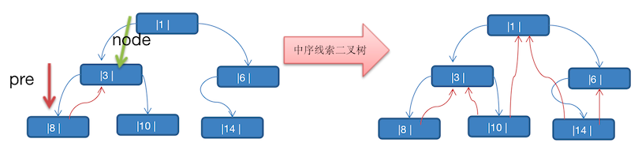

# 线索二叉树

[[toc]]

对一棵二叉树中所有节点的空指针域按照某种遍历方式加线索的过程叫作线索化，被线索化了的二叉树称为线索二叉树。

知道了“前驱”和“后继”信息，就可以把二叉树看作一个链表结构，从而可以像遍历链表那样来遍历二叉树，进而提高效率。

## 线索化二叉树

将上图的二叉树，进行 **中序线索二叉树**, 先中序遍历的数列为 `8,3,10,1,14,6`。

实现:

那么以上图为例，线索化二叉树后的样子如下图

* `8` 的后继节点为 `3`
* `3` 由于 左右节点都有元素，不能线索化
* `10` 的前驱节点为 `3`，后继节点为 `1`
* `1` 不能线索化
* `14` 的前驱节点为 `1`，后继节点为 `6`
* `6` 有左节点，不能线索化

::: warning 注意

当线索化二叉树后，那么一个 Node 节点的 left 和 right 属性，就有如下情况：

* left 指向的是 左子树，也可能是指向 前驱节点

例如：节点 1 left 节点指向的是左子树，节点 10 的 left 指向的就是前驱节点

* right 指向的是 右子树，也可能是指向 后继节点

例如：节点 3 的 right 指向的是右子树，节点 10 的 right 指向的是后继节点

:::

## 线索二叉树实现

::: tip 标识域
1. 如果ltag=0，表示指向节点的左孩子。
2. 如果ltag=1，则表示lchild为线索，指向节点的直接前驱
3. 如果rtag=0，表示指向节点的右孩子。
4. 如果rtag=1，则表示rchild为线索，指向节点的直接后继
:::

::: details 结构体定义

:::

