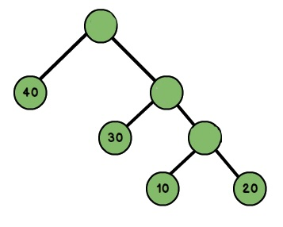
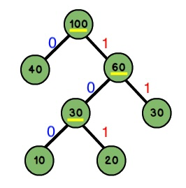

# 哈夫曼树

[[toc]]

给定 n 个 权值 作为 n 个 叶子节点，构造一颗二叉树，若该树的 带权路径长度（WPL）达到最小，称这样的二叉树为 最优二叉树，也称为 哈夫曼树（Huffman Tree），还有的叫 霍夫曼树




::: tip 哈夫曼树
* `路径与路径长度`: 从树中一个节点到另一个节点之间的分支构成了两个节点之间的路径，路径上的分支数目称作路径长度。若规定根节点位于第一层，则根节点到第H层的节点的路径长度为H-1。如到40 的路径长度为1；30的路径长度为2；20的路径长度为3。
* `节点的权`: 将树中的节点赋予一个某种含义的数值作为该节点的权值，该值称为节点的权；
* `带权路径长度`: 从根节点到某个节点之间的路径长度与该节点的权的乘积。例如上图节点10的路径长度为3,它的带权路径长度为10 * 3 = 30；
* `树的带权路径长度`: 树的带权路径长度为所有叶子节点的带权路径长度之和，称为WPL。上图的WPL = 1x40+2x30+3x10+3x20 = 190，而哈夫曼树就是树的带权路径最小的二叉树。
:::


## 哈夫曼树的构建

假设有n个权值，则构造出的哈夫曼树有n个叶子结点。 n个权值分别设为 w1、w2、…、wn，哈夫曼树的构造规则为:将w1、w2、…，wn看成是有n 棵树的森林(每棵树仅有一个结点)；在森林中选出根结点的权值最小的两棵树进行合并，作为一棵新树的左、右子树，且新树的根结点权值为其左、右子树根结点权值之和；从森林中删除选取的两棵树，并将新树加入森林；重复上面两步，直到森林中只剩一棵树为止，该树即为所求得的哈夫曼树。

上图中，它的叶子节点为{10，20，30，40}，以这4个权值构建哈夫曼树的过程为:


## 哈夫曼编码为

由如下规则获得它们的哈夫曼编码:

从根节点到每一个叶子节点的路径上，左分支记为0，右分支记为1，将这些0与1连起来即为叶子节点的哈夫曼编码





{10，20，30，40}这四个权值构建了哈夫曼编码后

```
10: 100
20: 101
30: 11
40: 0
```

## 带权路径长度

树中所有结点的带权路径长度之和称为全树的带权路径长度，记为：

$WPL = {\sum_{i=1}^{n}W_iL_i}$

Wi 是第i个结点所带的权值，Li 是该结点到根结点的路径长度, 根结点为0开始计算。


WPL = 10 * 3 + 20 * 2 + 30 * 1 + 40 * 1 = 190


