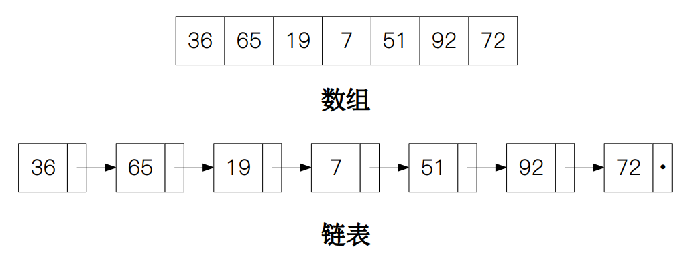
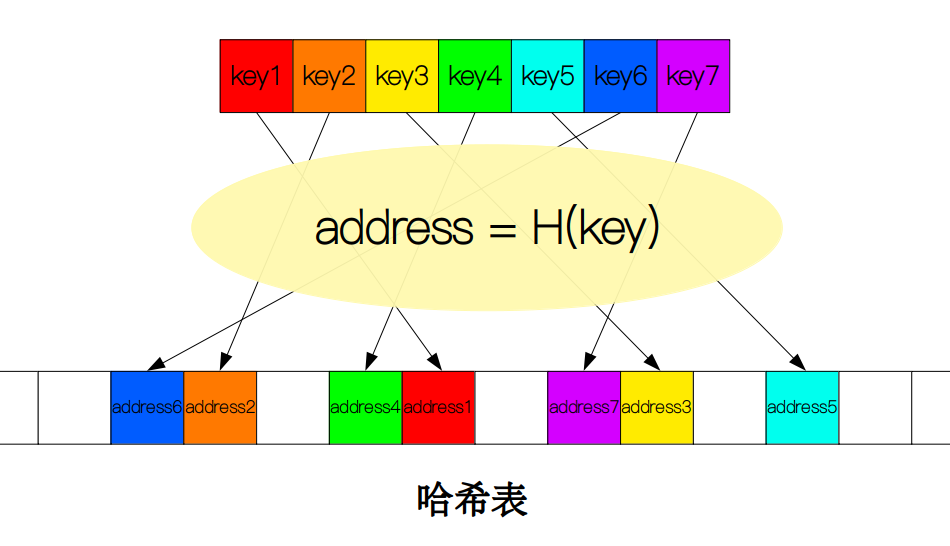
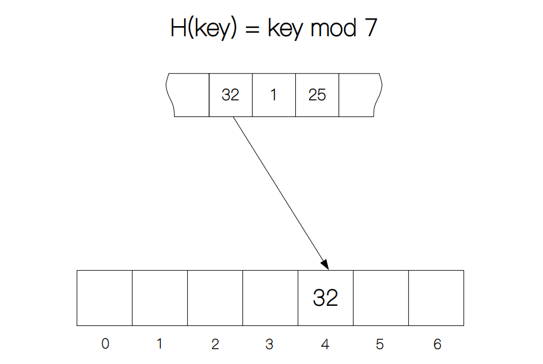
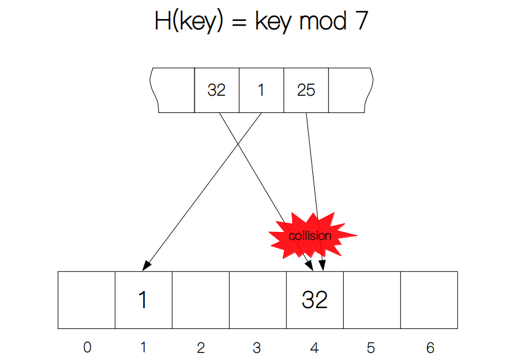
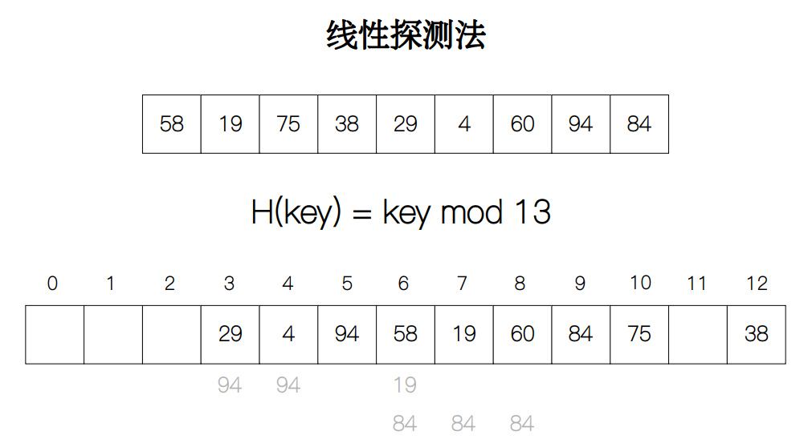
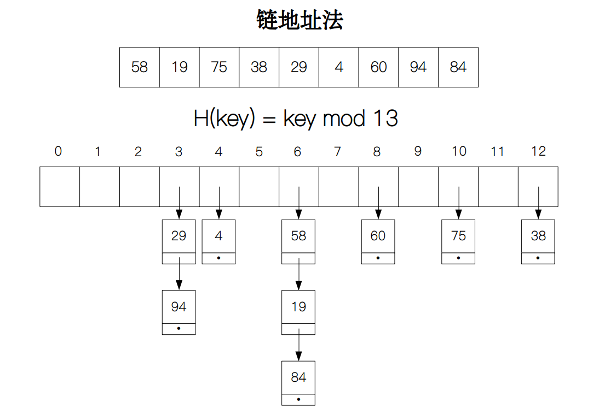
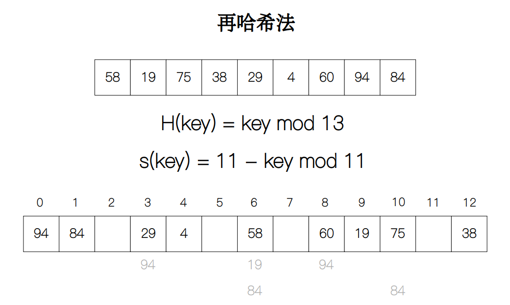

# 散列表 (Hash table)

[[toc]]

## 介绍

在这一节内容里，我们会介绍一种新的概念：哈希（hashing）。或许你对哈希这个概念还不是很了解，但你一定听说了在比特币交易中所用到的区块链技术，不管你是挖矿还是简单的交易，都离不开哈希算法。事实上，哈希算法还广泛地运用在银行、通讯、商业等领域，它们的目的只有一个，那就是加密，因为经过一些基于哈希加密的算法几乎不能够被破解。

除了加密之外，哈希还被广泛运用在快速查找领域，因为它查找的高效性，一些主流的编程语言都采用了这种方式来做数据之间的映射。比如 Python 中的字典类型dict，Java 中的HashMap等等。它们都能够在很短的时间内从上百万条记录中找到我们所需要的内容。这么厉害～下面我们就来探究一下它的原理吧。

## 哈希表

我们知道，查找可以通过两种数据结构来实现：数组和链表。两者的主要区别在于数据是否存储在连续的地址空间中，但无论是哪一种，我们从外部访问的时候，都是访问的第一个元素或节点的地址，这就造成了如果需要查找一个值或记录，我们要从头开始，遍历整个数组或链表，直到找到该值或查找失败。因此无论是数组还是链表，查找的平均时间复杂度都为 Θ(n)。

既然查找一个元素都需要先获取该数据结构头部的地址，那么我们可不可以直接获取一个元素对应的存储地址呢？这样我每输入一个要查找的元素就会对应输出该元素对应的地址，查找效率不就上去了吗？答案肯定的，但这我们里需要用到一种特殊的数据结构：哈希表。

哈希表（hash table）也叫散列表。它是用来存储经过哈希操作后的数据，每一个数据都对应一个地址，供外部程序来访问。当需要查找一个值key时，我们需要用一个函数H(key)将key映射到一个特定的地址address上，然后比较该地址上的值来判断是否查找成功。

## 哈希函数

要想实现key到address之间的映射关系，我们需要借助一个特殊的函数，哈希函数（hash function）。哈希函数多种多样，但它们的功能都只有一个，那就是将不同的key均匀分散地分布在哈希表中，以达到便于查找的目的。最常见的，也是最简单的哈希函数就是取余操作，即H(key) = key mod m，其中m表示哈希表的长度。

举个例子，假设哈希函数H(key) = key mod 7，当key为 32 时，计算出的结果等于 4，这里的 4 就代表由哈希函数计算出的哈希地址address，当然这里的地址并非计算机的物理地址，只是为了方便而举的例子而已。在哈希表中我们就在索引为 4 的位置记录下 32。下次查找的时候，我们就可以通过哈希函数计算出的地址然后直接访问表里的值了。

但是，如果其他值key'通过哈希函数计算得到了相同的地址，这就会造成一种现象叫做冲突（collision），比如 25 mod 7 也等于 4，造成了 25 不能够直接存储在索引为 4 的位置。为了解决冲突的问题，我们需要采用一些机制来保证那些冲突的元素能够存储在正确的位置，下面就来分别介绍一下几种主要的处理冲突的方法。

## 冲突处理

我们将用三种处理冲突的方法来构建哈希表。元素从数组[58, 19, 75, 38, 29, 4, 60, 94, 84]中获取，因为哈希表的长度为 13，所以哈希函数为H(key) = key mod 13。

### 线性探测法

线性探测法（linear probing）是将冲突元素放在产生冲突地址的下一个位置单元的方式来处理冲突，如再冲突，就再探测下一个位置单元是否冲突，直到不冲突为止（如果最后一个索引值是冲突，那么就探测第一个索引值是否冲突）。比如，索引 6 的位置发生了冲突，那么就探测索引 7 是否也冲突，如果不冲突就把元素存储在索引 7 的位置上；如果继续冲突就探测索引 8，以此类推，直到不冲突为止。

将上面的数组按照顺序放入到哈希表中：

H(58) = 58 mod 13 = 6，索引为 6 的位置为空，所以元素 58 直接放入到哈希表中。

H(19) = 19 mod 13 = 6，索引为 6 的位置不为空，探测索引 7，发现位置为空，所以元素 19 就放入到索引 7 的位置。

H(75) = 75 mod 13 = 10，索引为 10 的位置为空，所以元素 75 直接放入到哈希表中。

H(38) = 38 mod 13 = 12，索引为 12 的位置为空，所以元素 38 直接放入到哈希表中。

H(29) = 29 mod 13 = 3，索引为 3 的位置为空，所以元素 29 直接放入到哈希表中。

H(4) = 4 mod 13 = 4，索引为 4 的位置为空，所以元素 4 直接放入到哈希表中。

H(60) = 60 mod 13 = 8，索引为 8 的位置为空，所以元素 60 直接放入到哈希表中。

H(94) = 94 mod 13 = 3，索引为 3 的位置不为空，探测索引 4，发现还是不为空，继续探测索引 5，发现位置为空，所以元素 94 就放入到索引 5 的位置。

H(84) = 84 mod 13 = 6，索引为 6 的位置不为空，探测索引 7，发现还是不为空，继续探测索引 8，也不为空，继续探测索引 9，发现位置为空，所以元素 84 就放入到索引 9 的位置。

#### 查找

查找跟链地址法相似，也是先计算哈希值，找到对应元素，如果值相等，就查找成功；如果不相等，就按照线性探测的方式看下一个索引值对应的元素的值是否相等，这样一直探测下去，直到探测到的值为 None，即查找失败。

假设还是查找 84 和 22，查找 84 时，先计算出哈希值为 6，而索引 6 对应元素的值为 58，不等于 84，所以继续探测下一个索引值，发现还是不相等，于是继续探测，直到最后我们在索引 9 的位置探测到 84 = 84，故查找成功。如果查找值为 22，其哈希值计算得到为 9，发现 22 不等于对应元素的值 89，所以要继续探测，探测两轮后发现索引 11 为空，所以查找失败。

### 二次探测法

二次探测法（quadratic probing）是线性探测法的改进，它将线性探测的步长改为平方值，如再冲突，就再探测下一个位置单元的平方值，直到不冲突为止（如果最后一个索引值是冲突，那么就探测第一个索引值是否冲突）。比如，索引 6 的位置发生了冲突，那么就探测索引 7 的平方值，如果还是冲突，就探测索引 8 的平方值，以此类

将上面的数组按照顺序放入到哈希表中：

H(58) = 58 mod 13 = 6，索引为 6 的位置为空，所以元素 58 直接放入到哈希表中。

H(19) = 19 mod 13 = 6，索引为 6 的位置不为空，探测索引 $7 = 6 + 1^2$ ，发现位置为空，所以元素 19 就放入到索引 7 的位置。

H(75) = 75 mod 13 = 10，索引为 10 的位置为空，所以元素 75 直接放入到哈希表中。

H(38) = 38 mod 13 = 12，索引为 12 的位置为空，所以元素 38 直接放入到哈希表中。

H(29) = 29 mod 13 = 3，索引为 3 的位置为空，所以元素 29 直接放入到哈希表中。

H(4) = 4 mod 13 = 4，索引为 4 的位置为空，所以元素 4 直接放入到哈希表中。

H(60) = 60 mod 13 = 8，索引为 8 的位置为空，所以元素 60 直接放入到哈希表中。

H(94) = 94 mod 13 = 3，索引为 3 的位置不为空，探测索引 $4 = 3 + 1^2$ ，发现还是不为空，继续探测索引 $2 = 3 - 1^2$，发现位置为空，所以元素 94 就放入到索引 2 的位置。

H(84) = 84 mod 13 = 6，索引为 6 的位置不为空，探测索引 $7 = 6 + 1^2$，发现还是不为空，继续探测索引 $5 = 6 - 1^2$，发现位置为空，所以元素 84 就放入到索引 5 的位置。

$H(key) = Key  Mod  13$

$id = (1^2, -1^2, 2^2, -2^2, 3^2, -3^2, ..., q^2, -q^2)$

$S(key) = H(key) + id$

0 | 1 | 2 | 3 | 4 | 5 | 6 | 7 | 8 | 9 | 10 | 11 | 12
-----|-----|-----|------|------|------|------|------|------|------|------|------|-----
0 | 0 | 94 | 29 | 4 | 84 | 58 | 19 | 60 | 0 | 75 | 0 | 38
0 | 0 | 3 | 1 | 1 | 2 | 1 | 2 | 1 | 0 | 1 | 0 | 1

#### 查找

### 链地址法

链地址法（separate chaining）是将冲突的元素以链表的形式储存起来，具体来讲，具有相同的哈希地址的元素用节点的方式保存在链表的尾部。

将上面的数组按照顺序放入到哈希表中：

H(58) = 58 mod 13 = 6，索引为 6 的位置为空，所以节点 58 直接放入到哈希表中。

H(19) = 19 mod 13 = 6，索引为 6 的位置不为空，所以需要将节点 19 连到节点 58 的后面。

H(75) = 75 mod 13 = 10，索引为 10 的位置为空，所以节点 75 直接放入到哈希表中。

H(38) = 38 mod 13 = 12，索引为 12 的位置为空，所以节点 38 直接放入到哈希表中。

H(29) = 29 mod 13 = 3，索引为 3 的位置为空，所以节点 29 直接放入到哈希表中。

H(4) = 4 mod 13 = 4，索引为 4 的位置为空，所以节点 4 直接放入到哈希表中。

H(60) = 60 mod 13 = 8，索引为 8 的位置为空，所以节点 60 直接放入到哈希表中。

H(94) = 94 mod 13 = 3，索引为 3 的位置不为空，所以需要将节点 94 连到节点 29 的后面。

H(84) = 84 mod 13 = 6，索引为 6 的位置不为空，所以需要将节点 84 连到节点 19 的后面。

#### 查找

查找的时候，我们先计算查找元素的哈希值，然后从哈希表中找到对应的元素的值，如果值为空（None），那么就查找失败，如果不为空，那么就从链表里查找该元素。

假设查找的值为 84，计算出哈希值为 6，由于索引 6 的位置不为空，所以我们从链表中查找，最后查找成功。如果查找元素 22，计算出哈希值为 9，发现索引 9 的位置为空，因此查找失败。

### 再哈希法

再哈希法（rehashing）是通过用另外一个哈希函数的方式来处理冲突。具体来讲，我们将原哈希值l = H(key)加上另外一个哈希函数的值s(key)，再把相加后的结果放到原哈希函数里计算哈希值H(l + s(key))，然后看是否冲突，如不冲突就把元素存储到对应索引值的下方；如果还是冲突，就计算H(l + 2s(key))的值然后再判断，这样以此类推，直到不冲突为止。

还是来看具体的例子，这里的再哈希函数为s(key) = m - 2 - key mod (m - 2) = 11 - key mod 11。

H(58) = 58 mod 13 = 6，索引为 6 的位置为空，所以元素 58 直接放入到哈希表中。

H(19) = 19 mod 13 = 6，索引为 6 的位置不为空，再哈希后 H(l + s(key)) = 9，发现位置为空，所以元素 19 就放入到索引 9 的位置。

H(75) = 75 mod 13 = 10，索引为 10 的位置为空，所以元素 75 直接放入到哈希表中。

H(38) = 38 mod 13 = 12，索引为 12 的位置为空，所以元素 38 直接放入到哈希表中。

H(29) = 29 mod 13 = 3，索引为 3 的位置为空，所以元素 29 直接放入到哈希表中。

H(4) = 4 mod 13 = 4，索引为 4 的位置为空，所以元素 4 直接放入到哈希表中。

H(60) = 60 mod 13 = 8，索引为 8 的位置为空，所以元素 60 直接放入到哈希表中。

H(94) = 94 mod 13 = 3，索引为 3 的位置不为空，再哈希后 H(l + s(key)) = 8，发现还是不为空，继续再哈希， H(l + 2s(key)) = 0，发现位置为空，所以元素 94 就放入到索引 0 的位置。

H(84) = 84 mod 13 = 6，索引为 6 的位置不为空，再哈希后 H(l + s(key)) = 10，发现还是不为空，继续再哈希，H(l + 2s(key)) = 1，发现位置为空，所以元素 84 就放入到索引 1 的位置。

查找也跟线性探测法相似，先计算哈希值，如果对应元素的值相等就查找成功，否则就再哈希，直到对应元素的值为 None，即查找失败。例如要查找 22，计算得到哈希值为 9，发现 22 不等于对应元素的值 89，于是我们再哈希，得到的哈希值为 7，对应值为 None，所以查找失败。

