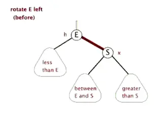
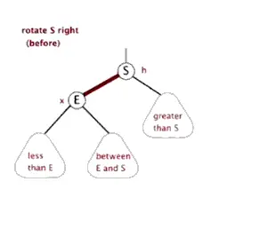

# 红黑树

[[toc]]

红黑树是一种自平衡的二叉查找树，是一种高效的查找树。它是由 Rudolf Bayer 于1978年发明，在当时被称为对称二叉 B 树(symmetric binary B-trees)。后来，在1978年被 Leo J. Guibas 和 Robert Sedgewick 修改为如今的红黑树。红黑树具有良好的效率，它可在 O(logN) 时间内完成查找、增加、删除等操作。因此，红黑树在业界应用很广泛，比如 Java 中的 TreeMap，JDK 1.8 中的 HashMap、C++ STL 中的 map 均是基于红黑树结构实现的。考虑到红黑树是一种被广泛应用的数据结构，所以我们很有必要去弄懂它。

红黑树是一种自平衡二叉搜索树，通过在插入和删除时调整二叉树结构，保持二叉树深度平衡，提高查找效率。

### 红黑树特性

1. 每个节点的颜色是黑色或者红色；
2. 根节点为黑色；
3. 叶节点（NULL）是黑节点，实际不存在；
4. 红节点的子节点是黑节点；
5. 从一个节点到叶节点的路径上包含相同数目的黑节点，黑色平衡树；

特性5保证红黑树从根节点到叶节点的最长路径不大于最短路径的两倍，保证黑色平衡的特性。由于这一约束的存在，将插入节点的颜色标记为红色，能够尽可能避免自平衡，插入黑色节点必须做自平衡。红黑色通过旋转和变色保持自平衡！

### 左旋

左旋的动态图可以见下图：

### 右旋

右旋的动态图可以见下图：

