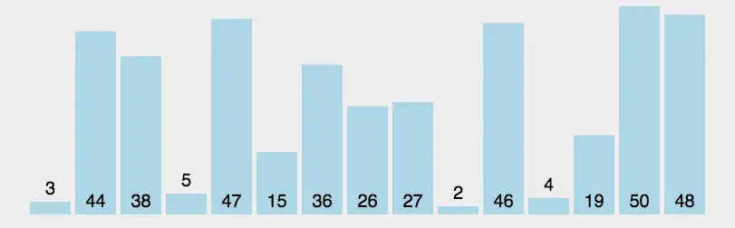

# 排序

[[toc]]

## 冒泡排序
冒泡排序，又称起泡排序。他是一种基于交换的排序典型，也是快排思想的基础。对于冒泡排序名字的由来，

冒泡排序是一种简单的排序算法。它重复地走访过要排序的数列，一次比较两个元素，如果它们的顺序错误就把它们交换过来。走访数列的工作是重复地进行直到没有再需要交换，也就是说该数列已经排序完成。这个算法的名字由来是因为越小的元素会经由交换慢慢“浮”到数列的顶端。

时间复杂度：O(n^2)

空间复杂度：O(1)

稳定性：稳定

### 算法描述

1. 比较相邻的元素。如果第一个比第二个大，就交换它们两个；
2. 对每一对相邻元素作同样的工作，从开始第一对到结尾的最后一对，这样在最后的元素应该会是最大的数；
3. 针对所有的元素重复以上的步骤，除了最后一个；
4. 重复步骤1~3，直到排序完成。

### 动图演示

## 选择排序

选择排序是一种简单直观的排序算法，它也是一种交换排序算法，和冒泡排序有一定的相似度，可以认为选择排序是冒泡排序的一种改进。

### 算法描述
1. 在未排序序列中找到最小（大）元素，存放到排序序列的起始位置
2. 从剩余未排序元素中继续寻找最小（大）元素，然后放到已排序序列的末尾。
3. 重复第二步，直到所有元素均排序完毕。

### 动图演示

## 插入排序

插入排序是一种简单直观的排序算法。它的工作原理是通过构建有序序列，对于未排序数据，在已排序序列中从后向前扫描，找到相应位置并插入。

### 算法描述

把待排序的数组分成已排序和未排序两部分，初始的时候把第一个元素认为是已排好序的。
从第二个元素开始，在已排好序的子数组中寻找到该元素合适的位置并插入该位置。
重复上述过程直到最后一个元素被插入有序子数组中。

### 动图演示

## 归并排序

归并排序是建立在归并操作上的一种有效的排序算法。该算法是采用分治法的一个非常典型的应用。将已有序的子序列合并，得到完全有序的序列；即先使每个子序列有序，再使子序列段间有序。若将两个有序表合并成一个有序表，称为2-路归并。

### 算法描述

#### 递归法（Top-down）

1. 申请空间，使其大小为两个已经排序序列之和，该空间用来存放合并后的序列
2. 设定两个指针，最初位置分别为两个已经排序序列的起始位置
3. 比较两个指针所指向的元素，选择相对小的元素放入到合并空间，并移动指针到下一位置
4. 重复步骤3直到某一指针到达序列尾
5. 将另一序列剩下的所有元素直接复制到合并序列尾

#### 迭代法（Bottom-up）

原理如下（假设序列共有n个元素）：

1. 将序列每相邻两个数字进行归并操作，形成ceil(n/2)个序列，排序后每个序列包含两/一个元素
2. 若此时序列数不是1个则将上述序列再次归并，形成ceil(n/4)个序列，每个序列包含四/三个元素
3. 重复步骤2，直到所有元素排序完毕，即序列数为1

### 动图演示

### 过程图示

归并排序是递归算法的一个实例，这个算法中基本的操作是合并两个已排序的数组，取两个输入数组 A 和 B，一个输出数组 C，以及三个计数器 i、j、k，它们初始位置置于对应数组的开始端。

A[i] 和 B[j] 中较小者拷贝到 C 中的下一个位置，相关计数器向前推进一步。

**当两个输入数组有一个用完时候，则将另外一个数组中剩余部分拷贝到 C 中。**

**自顶向下的归并排序，递归分组图示：**

**对第三行两个一组的数据进行归并排序**

**对第二行四个一组的数据进行归并排序**

**整体进行归并排序**

## 快速排序

快速排序是一个知名度极高的排序算法，其对于大数据的优秀排序性能和相同复杂度算法中相对简单的实现使它注定得到比其他算法更多的宠爱。

### 算法描述

1. 从数列中挑出一个元素，称为"基准"（pivot），
2. 重新排序数列，所有比基准值小的元素摆放在基准前面，所有比基准值大的元素摆在基准后面（相同的数可以到任何一边）。在这个分区结束之后，该基准就处于数列的中间位置。这个称为分区（partition）操作。
3. 递归地（recursively）把小于基准值元素的子数列和大于基准值元素的子数列排序。

### 动图演示

## 堆排序

堆排序(Heapsort)是指利用堆积树（堆）这种数据结构所设计的一种排序算法，它是选择排序的一种。可以利用数组的特点快速定位指定索引的元素。堆排序就是把最大堆堆顶的最大数取出，将剩余的堆继续调整为最大堆，再次将堆顶的最大数取出，这个过程持续到剩余数只有一个时结束。

### 树的概念

### 堆的概念
堆是一种特殊的完全二叉树（complete binary tree）。完全二叉树的一个“优秀”的性质是，除了最底层之外，每一层都是满的，这使得堆可以利用数组来表示（普通的一般的二叉树通常用链表作为基本容器表示），每一个结点对应数组中的一个元素。
如下图，是一个堆和数组的相互关系：

对于给定的某个结点的下标 i，可以很容易的计算出这个结点的父结点、孩子结点的下标：

* Parent(i) = floor(i/2)，i 的父节点下标
* Left(i) = 2i，i 的左子节点下标
* Right(i) = 2i + 1，i 的右子节点下标
* 二叉堆一般分为两种：最大堆和最小堆。

#### 最大堆：
最大堆中的最大元素值出现在根结点（堆顶）
堆中每个父节点的元素值都大于等于其孩子结点（如果存在）

#### 最小堆：

最小堆中的最小元素值出现在根结点（堆顶）
堆中每个父节点的元素值都小于等于其孩子结点（如果存在）

### 堆排序原理

堆排序就是把最大堆堆顶的最大数取出，将剩余的堆继续调整为最大堆，再次将堆顶的最大数取出，这个过程持续到剩余数只有一个时结束。在堆中定义以下几种操作：

最大堆调整（Max-Heapify）：将堆的末端子节点作调整，使得子节点永远小于父节点
创建最大堆（Build-Max-Heap）：将堆所有数据重新排序，使其成为最大堆
堆排序（Heap-Sort）：移除位在第一个数据的根节点，并做最大堆调整的递归运算 继续进行下面的讨论前，需要注意的一个问题是：数组都是 Zero-Based，这就意味着我们的堆数据结构模型要发生改变

相应的，几个计算公式也要作出相应调整：

* Parent(i) = floor((i-1)/2)，i 的父节点下标
* Left(i) = 2 i + 1，i 的左子节点下标
* Right(i) = 2(i + 1)，i 的右子节点下标

### 堆的建立和维护

堆可以支持多种操作，但现在我们关心的只有两个问题：

给定一个无序数组，如何建立为堆？

删除堆顶元素后，如何调整数组成为新堆？

先看第二个问题。假定我们已经有一个现成的大根堆。现在我们删除了根元素，但并没有移动别的元素。想想发生了什么：根元素空了，但其它元素还保持着堆的性质。我们可以把最后一个元素（代号A）移动到根元素的位置。如果不是特殊情况，则堆的性质被破坏。但这仅仅是由于A小于其某个子元素。于是，我们可以把A和这个子元素调换位置。如果A大于其所有子元素，则堆调整好了；否则，重复上述过程，A元素在树形结构中不断“下沉”，直到合适的位置，数组重新恢复堆的性质。上述过程一般称为“筛选”，方向显然是自上而下。

> 删除后的调整，是把最后一个元素放到堆顶，自上而下比较

删除一个元素是如此，插入一个新元素也是如此。不同的是，我们把新元素放在末尾，然后和其父节点做比较，即自下而上筛选。

> 插入是把新元素放在末尾，自下而上比较

那么，第一个问题怎么解决呢？

常规方法是从第一个非叶子结点向下筛选，直到根元素筛选完毕。这个方法叫“筛选法”，需要循环筛选n/2个元素。

但我们还可以借鉴“插入排序”的思路。我们可以视第一个元素为一个堆，然后不断向其中添加新元素。这个方法叫做“插入法”，需要循环插入(n-1)个元素。

由于筛选法和插入法的方式不同，所以，相同的数据，它们建立的堆一般不同。大致了解堆之后，堆排序就是水到渠成的事情了。

### 算法步骤
1. 创建一个堆 H[0……n-1]；
2. 把堆首（最大值）和堆尾互换；
3. 把堆的尺寸缩小 1，并调用 shift_down(0)，目的是把新的数组顶端数据调整到相应位置；
4. 重复步骤 2，直到堆的尺寸为 1。

### 动画图示

## 希尔排序（插入排序的改良版）

在希尔排序出现之前，计算机界普遍存在“排序算法不可能突破O(n2)”的观点。希尔排序是第一个突破O(n2)的排序算法，它是简单插入排序的改进版。希尔排序的提出，主要基于以下两点：

插入排序算法在数组基本有序的情况下，可以近似达到O(n)复杂度，效率极高。
但插入排序每次只能将数据移动一位，在数组较大且基本无序的情况下性能会迅速恶化。

### 算法描述

先将整个待排序的记录序列分割成为若干子序列分别进行直接插入排序，具体算法描述：

1. 选择一个增量序列t1，t2，…，tk，其中ti>tj，tk=1；
2. 按增量序列个数k，对序列进行 k 趟排序；
3. 每趟排序，根据对应的增量ti，将待排序列分割成若干长度为m 的子序列，分别对各子表进行直接插入排序。仅增量因子为1 时，整个序列作为一个表来处理，表长度即为整个序列的长度。

### 动图演示

## 计数排序

计数排序不是基于比较的排序算法，其核心在于将输入的数据值转化为键存储在额外开辟的数组空间中。 作为一种线性时间复杂度的排序，计数排序要求输入的数据必须是有确定范围的整数。

### 算法描述

找出待排序的数组中最大和最小的元素；
统计数组中每个值为i的元素出现的次数，存入数组C的第i项；
对所有的计数累加（从C中的第一个元素开始，每一项和前一项相加）；
反向填充目标数组：将每个元素i放在新数组的第C(i)项，每放一个元素就将C(i)减去1。

### 动图演示

## 桶排序

桶排序又叫箱排序，是计数排序的升级版，它的工作原理是将数组分到有限数量的桶子里，然后对每个桶子再分别排序（有可能再使用别的排序算法或是以递归方式继续使用桶排序进行排序），最后将各个桶中的数据有序的合并起来。

> 计数排序是桶排序的一种特殊情况，可以把计数排序当成每个桶里只有一个元素的情况。网络中很多博文写的桶排序实际上都是计数排序，并非标准的桶排序，要注意辨别。

### 算法描述
找出待排序数组中的最大值max、最小值min
我们使用 动态数组ArrayList 作为桶，桶里放的元素也用 ArrayList 存储。桶的数量为(max-min)/arr.length+1
遍历数组 arr，计算每个元素 arr[i] 放的桶
每个桶各自排序
遍历桶数组，把排序好的元素放进输出数组

### 图示

## 基数排序

基数排序(Radix Sort)是桶排序的扩展，它的基本思想是：将整数按位数切割成不同的数字，然后按每个位数分别比较。
排序过程：将所有待比较数值（正整数）统一为同样的数位长度，数位较短的数前面补零。然后，从最低位开始，依次进行一次排序。这样从最低位排序一直到最高位排序完成以后, 数列就变成一个有序序列。

### 算法描述

取得数组中的最大数，并取得位数；
arr为原始数组，从最低位开始取每个位组成radix数组；
对radix进行计数排序(利用计数排序适用于小范围数的特点);

### 动图演示

## 排序算法 - 时间复杂度

