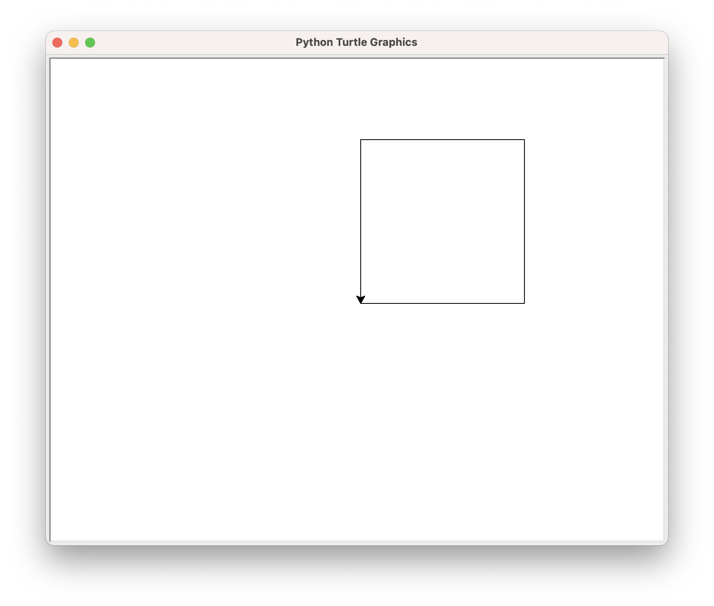
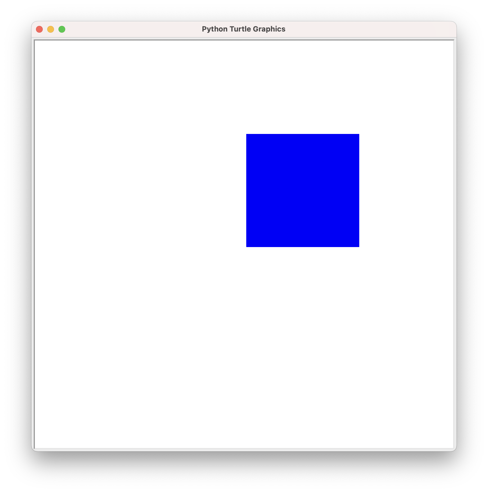
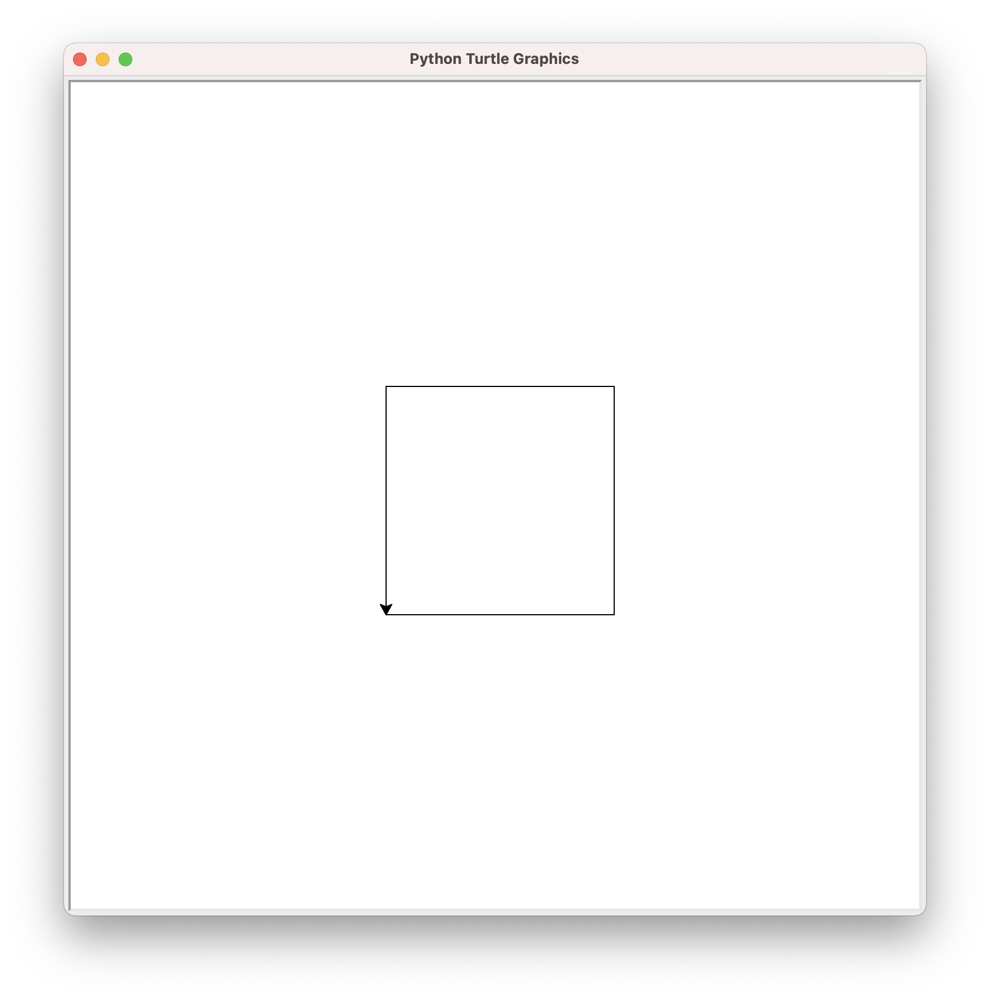
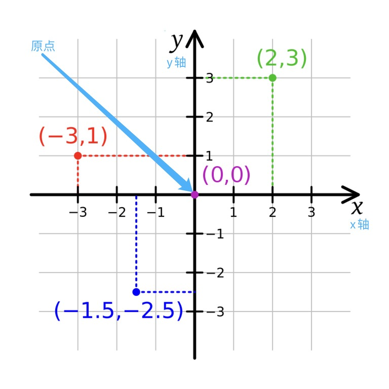
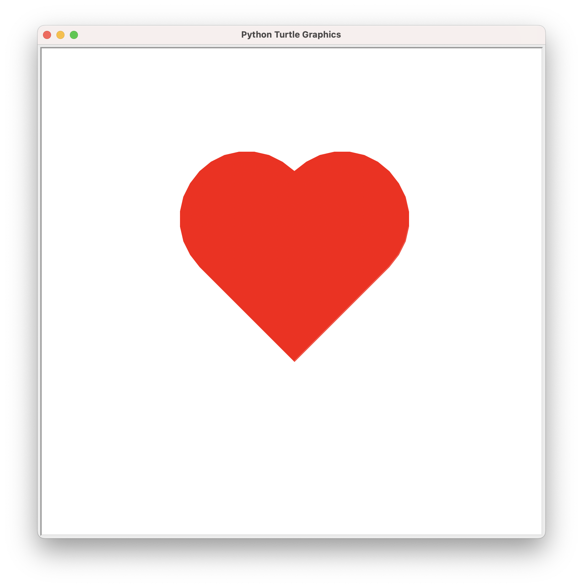

# 带你走进编程世界I

[[toc]]

### 引入turtle库

首先我们需要引入 `turtle` 库.

```python
from turtle import *
```

### 画笔控制

画笔落下时, 移动时将画线.

```python
pendown()
pd()       // 简写
down()     // 简写
```


画笔抬起时, 移动时不画线. 便于重新设定需要写线的坐标.

```python
penup()
pu()       // 简写
up()       // 简写
```

### 基本绘图

forward() 是让海龟向前走, 如果我们让海龟前进100步:

```python
forward()
forward(100)
```


## 正方形 (Square)

正方形是四边相等且四個角是直角的四边形。

正方形，是特殊的平行四边形之一。即有一组邻边相等，并且有一个角是直角的平行四边形称为正方形，又称正四边形。正方形，具有矩形和菱形的全部特性。

平面图形的周长就是它外围一圈的长度，即边长的总和。根据定义，正方形是四条边都相等，并且四个角都是直角的四边形。由于四条边长度都相等，所以计算正方形的周长是一件很简单的事。本文首先会介绍已知正方形的边长求周长的方法，然后会介绍已知正方形的面积求周长的方法，最后会介绍在已知圆半径的情况下，计算圆内接正方形周长的方法。

::: warning 性质

名称 | 性质
-----|-----
边 | 两组对边分别平行；四条边都相等；邻边互相垂直。
内角 | 四个角都是90°，内角和为360°。
对角线 | 对角线互相垂直；对角线相等且互相平分；每条对角线平分一组对角。
对称性 | 既是中心对称图形，又是轴对称图形（有四条对称轴）。
特殊性质 | 正方形的一条对角线把正方形分成两个全等的等腰直角三角形，对角线与边的夹角是45°；正方形的两条对角线把正方形分成四个全等的等腰直角三角形。
其他性质1 | 正方形具有平行四边形、菱形、矩形的一切性质与特性。
其他性质2 | 在正方形里面画一个最大的圆（正方形的内切圆），该圆的面积约是正方形面积的78.5%[4分之π]； 完全覆盖正方形的最小的圆（正方形的外接圆）面积大约是正方形面积的157%[2分之π]。
其他性质3 | 正方形是特殊的矩形，正方形是特殊的菱形。

-----

#### 计算公式:

周长 = 边长 x 4

面积 = 边长 x 边长
:::


### 画个正方形



::: details 代码

<<< @/code/open/square.py{py}

:::

### 正方形填充颜色

我们将上面的画的正方形用蓝色上色.

::: tip 操作步骤:

1. 我们先设置需要填充的颜色, 这里我们填充蓝色 `blue`
   ```md
	 color("blue")
	 ```
2. 设置开始和结束上色操作.
   ```md
	 begin_fill()     // 填充开始
	 ...             // 画完封闭的图形
	 end_fill()       // 填充结束
	 ```
:::



::: details 代码

<<< @/code/open/square2.py{py}

:::


::: details 思考题

如果将正方形正好与屏幕对齐, 像下面的图所示, 我们应该怎么实现呢? 



:::


## 直角坐标系

在平面内画两条互相垂直，并且有公共原点的数轴。其中横轴为X轴，纵轴为Y轴。这样我们就说在平面上建立了平面直角坐标系，简称直角坐标系。还分为第一象限，第二象限，第三象限，第四象限。从右上角开始数起，逆时针方向算起。

### 笛卡尔坐标系 

笛卡尔坐标系（法语：système de coordonnées cartésiennes，英语：Cartesian coordinate system，也称直角坐标系）在数学中是一种正交坐标系，由法国数学家勒内·笛卡尔引入而得名。二维的直角坐标系是由两条相互垂直、相交于原点的数线构成的。在平面内，任何一点的坐标是根据数轴上对应的点的坐标设定的。在平面内，任何一点与坐标的对应关系，类似于数轴上点与坐标的对应关系。


### 坐标系的表示

横向移动, 也就是左右移动, 这个叫x坐标.

纵向移动, 也就是上下移动, 这个叫y坐标.

以原点为开始的位置, 用符号来表示方向, 然后再加移动的长度. 注意在这里(+)可以不用写.
1. 如果向右移动用(+)
2. 如果向左移动用(-)
3. 如果向上移动用(+)
4. 如果向下移动用(-)





```md
坐标点(-3, -10)
      ||| | `------------ y轴移动长度为10
      ||| `-------------- y轴移动的方向为向下, -表示向下, +表示向上		
      ||`---------------- 分隔符, 区分x轴和y轴
      |`----------------- x轴移动长度为3
      `------------------ x轴移动的方向为向左, -表示向左, +表示向右
```


::: details 代码

<<< @/code/open/square1.py{py}

:::

## 爱心




::: details 代码

<<< @/code/open/heart.py{py}

:::
