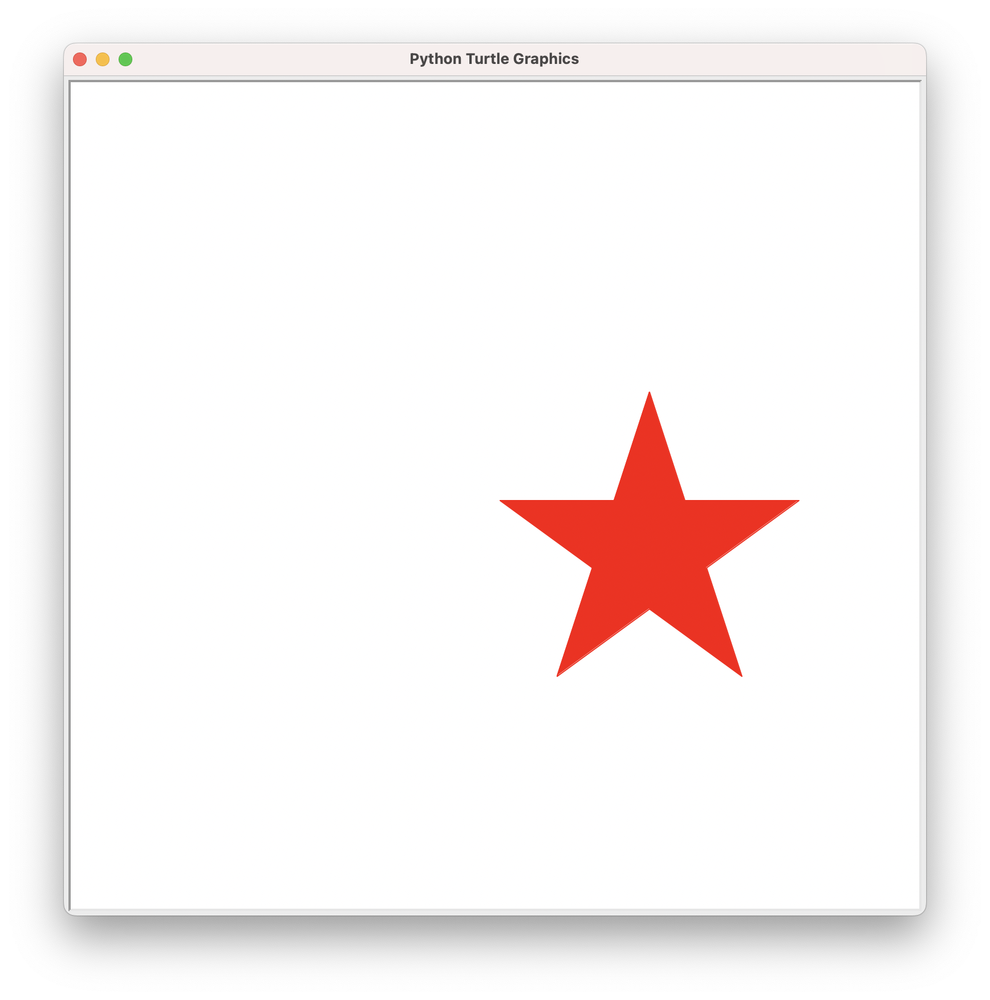
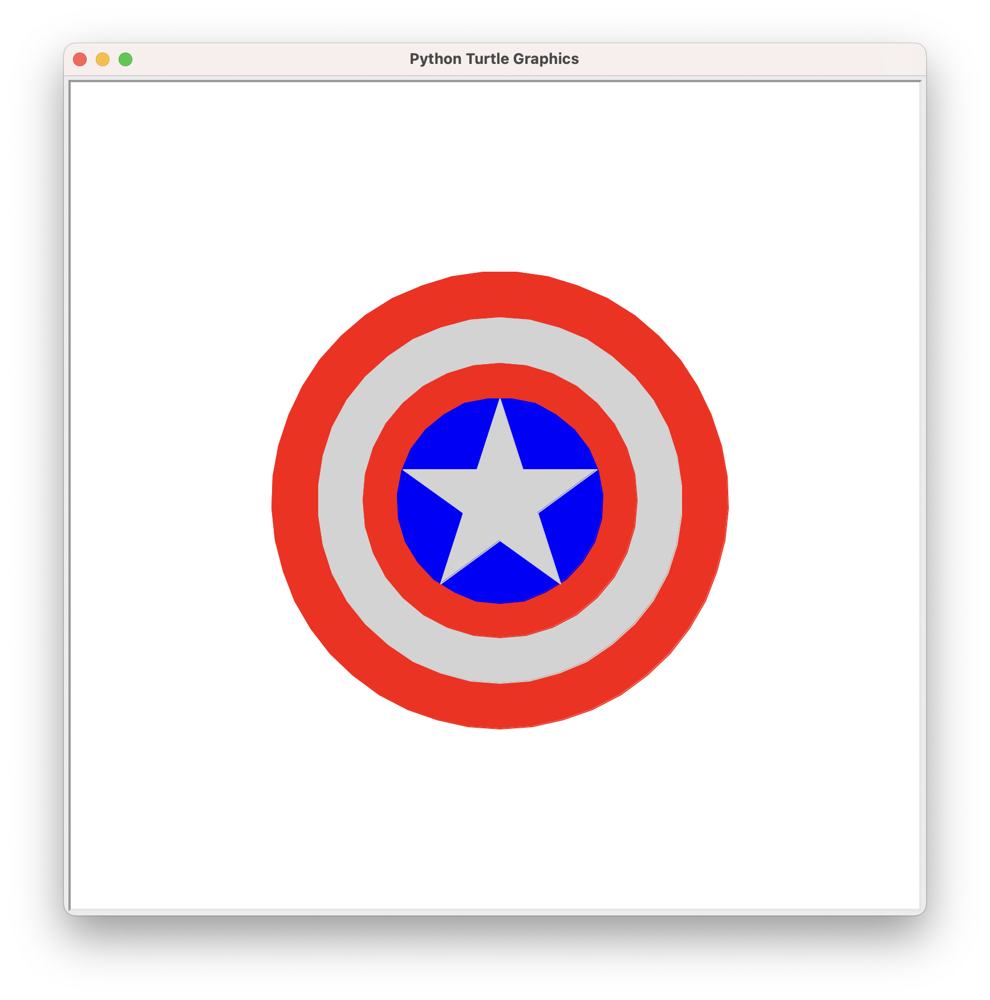

# 带你走进编程世界II

[[toc]]

## 复习回顾

复习一下上次课我们所学的画图函数.

::: tip 思考题

我们上次画了那里图形?

1. 一条直线
2. 正方形
3. 三角形
4. 圆形
5. 爱心

:::

## 五角星

五角星是指一种有五只尖角、并以五条直线画成的星星图形。英文“五角星”（pentagram）一词出于希腊语，原意大概是“五条直线的”或“五条线”。中文“五角星”的意义则显而易见，指有五只角的星形。然而，中文“五角星”不一定指“标准”五角星。中文“五角星”一词有时亦泛指所有有五只角的星形物。

### 特性

1. 5条边长度都相等
2. 5个角的角度都相等, 每个角都是36度
3. 内角各为180度

::: details 代码

<<< @/code/open/wu.py{py}

:::

## 美国队长盾牌

::: details 代码

<<< @/code/open/dun.py{py}

:::

## 彩虹

::: details 代码

<<< @/code/open/caihong.py{py}

:::

